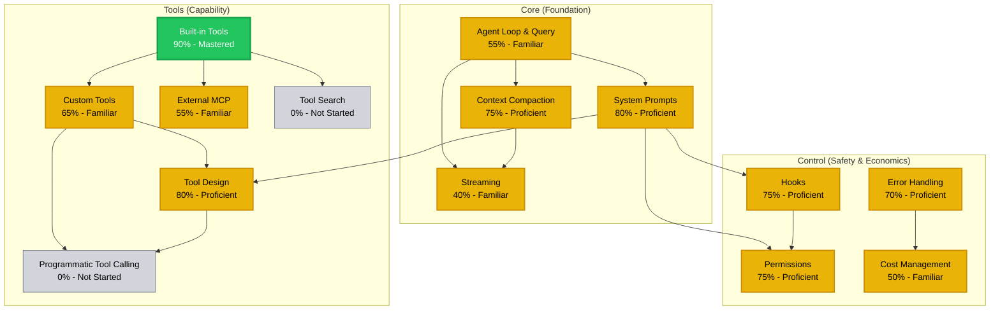
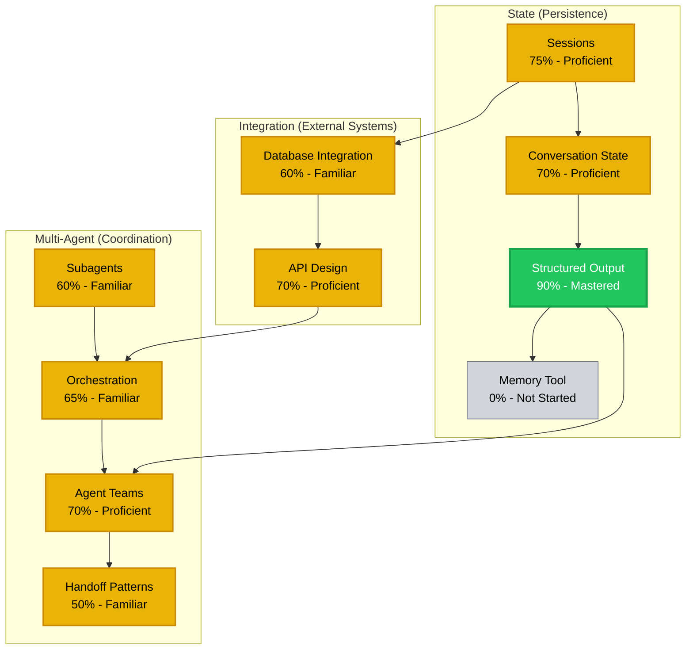
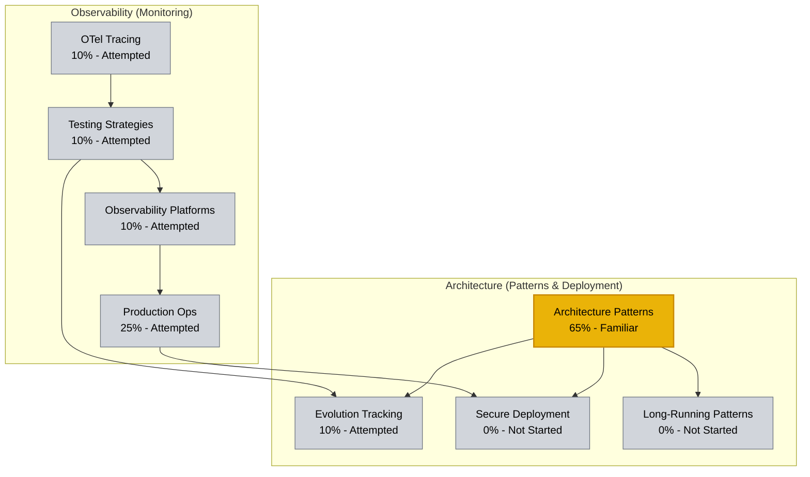

# Claude Agent SDK: Dependency Graph & Mastery Overlay

## Module 1: Core Competencies & Tools Foundation

---

## Module 2: State Management & Multi-Agent Patterns

---

## Module 3: Production Readiness & Advanced Architecture

---

## Mastery Levels Reference

| Level | Color | Threshold | Description |
|-------|-------|-----------|-------------|
| **Mastered** | Green (#22c55e) | ≥85% | Can teach others; applies in novel contexts; deep fluency |
| **Proficient** | Yellow (#eab308) | 30-84% | Solves standard problems independently; grasps underlying principles |
| **Familiar** | Yellow (#eab308) | 30-84% | Completes guided tasks; understands key concepts |
| **Attempted** | Gray (#d1d5db) | <30% | Exposure only; significant gaps remain |
| **Not Started** | Gray (#d1d5db) | 0% | No engagement yet |

---

## Key Prerequisites by Cluster

### Core → Tools
- **Agent Loop & Query** must precede Tool Design (understand how queries invoke tools)
- **System Prompts** enables Tool Design (tools are invoked via prompt engineering)

### Core → Control
- **System Prompts** must precede Permissions & Hooks (these modify prompt behavior)
- **Error Handling** required before Cost Management (failures drive cost overruns)

### State → Multi-Agent
- **Structured Output** prerequisite for Agent Teams (teams coordinate via structured messages)
- **Sessions** enables persistence in handoff patterns

### Multi-Agent → Integration
- **Orchestration** required before API Design (design APIs for agent consumption)
- **Database Integration** enables team coordination (shared state layer)

### All → Production Readiness
- Production Ops requires foundations in all three lower clusters
- Secure Deployment requires Architecture Patterns + Control cluster mastery
