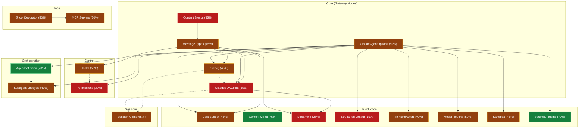

# Claude Agent SDK: Knowledge Graph & Mastery Overlay

## Full Graph (20 vertices)

## Legend
- **Green (Proficient 70-89%):** AgentDefinition, Context Management, Settings/Plugins
- **Yellow (Familiar 40-69%):** query(), Options, Messages, Tools, MCP, Hooks, Subagent Lifecycle, Sessions, Cost, Thinking, Model Routing, Sandbox
- **Orange (Attempted 10-39%):** ClaudeSDKClient, Content Blocks, Permissions, Streaming, Structured Output

## Coverage: 44.3% weighted

## Task Class → Vertex Mapping

| TC | Focus | Key Vertices |
|---|---|---|
| **TC1** | Session Storage Backend | query, tools, MCP, messages, content-blocks, options, sessions |
| **TC2** | Cost & Observability | hooks, permissions, cost, streaming, thinking |
| **TC3** | Teams vs Subagents | subagent-lifecycle, client, model-routing, agent-definition |
| **TC4** | Intelligence & Eval | structured-output, sessions, tools, hooks |
