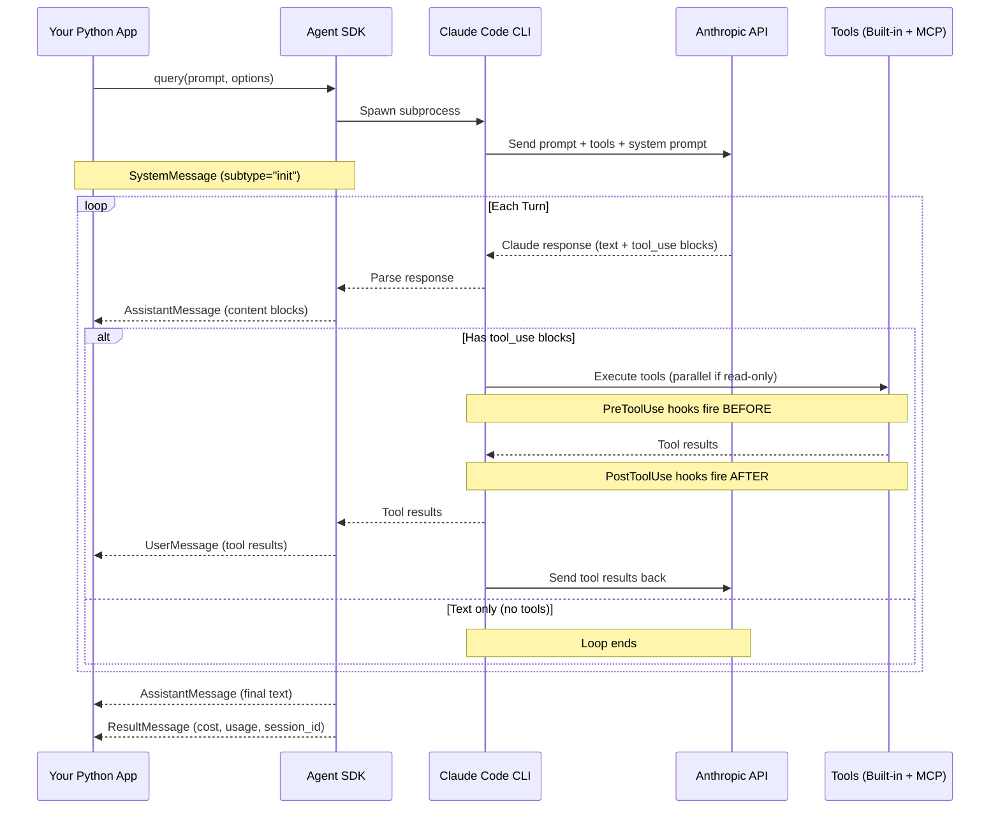
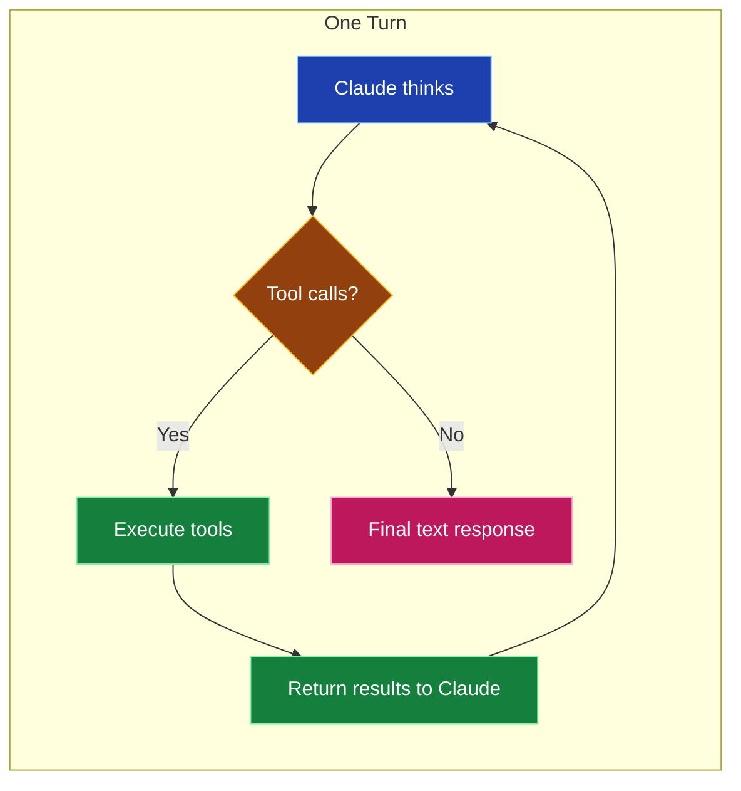
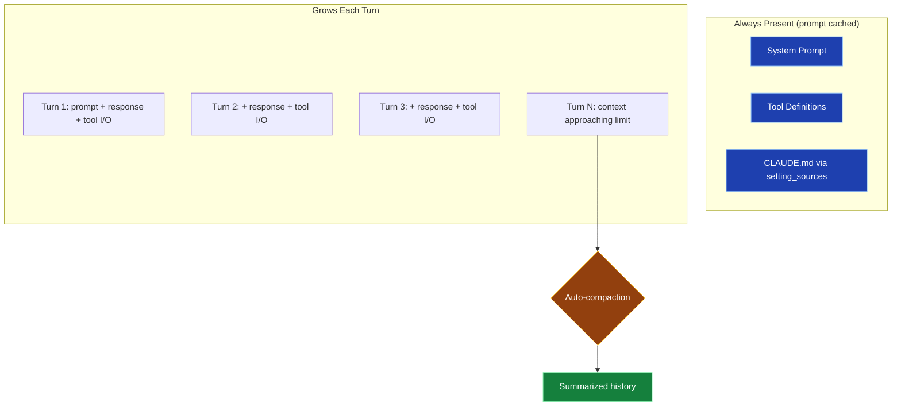
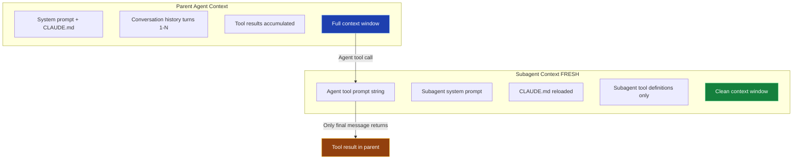

# Agent Loop Lifecycle — Visual Reference

## The Complete Agent Loop



## Message Flow Within a Turn



## Turn Counting

```
max_turns counts TOOL-USE turns only (not the final text turn)

Turn 1: Claude calls Bash("npm test")       ← counts
Turn 2: Claude calls Read("auth.ts")        ← counts
Turn 3: Claude calls Edit("auth.ts", ...)   ← counts
Turn 4: "Fixed the bug, all tests pass"     ← does NOT count (text only)

max_turns=3 would have stopped BEFORE Turn 3
```

## What Accumulates in Context



## Subagent Context Isolation


