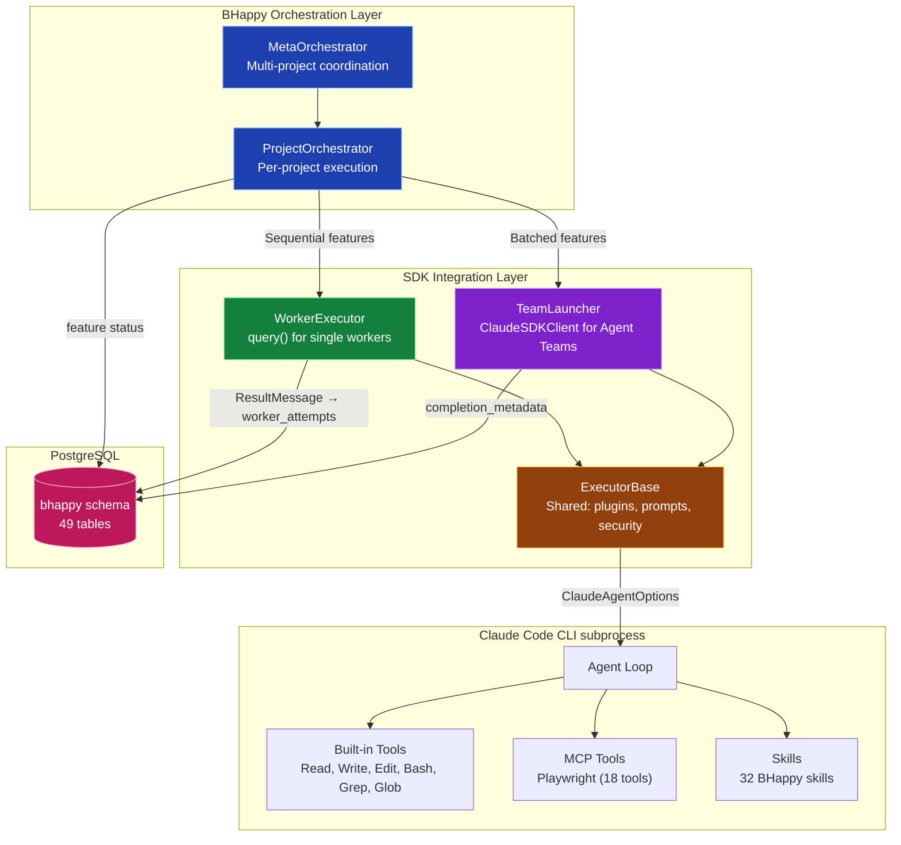
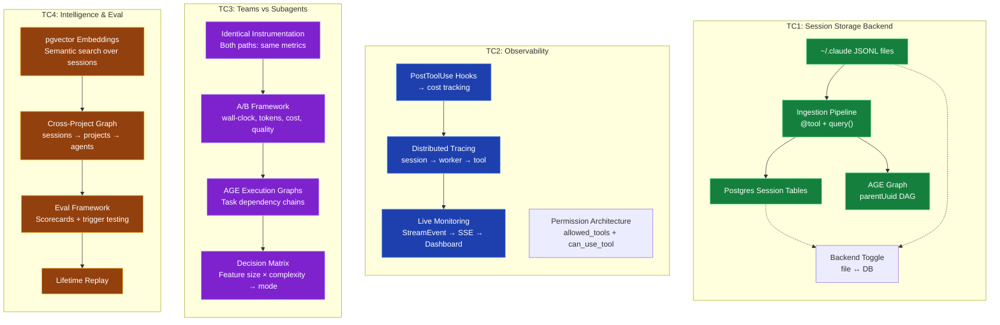
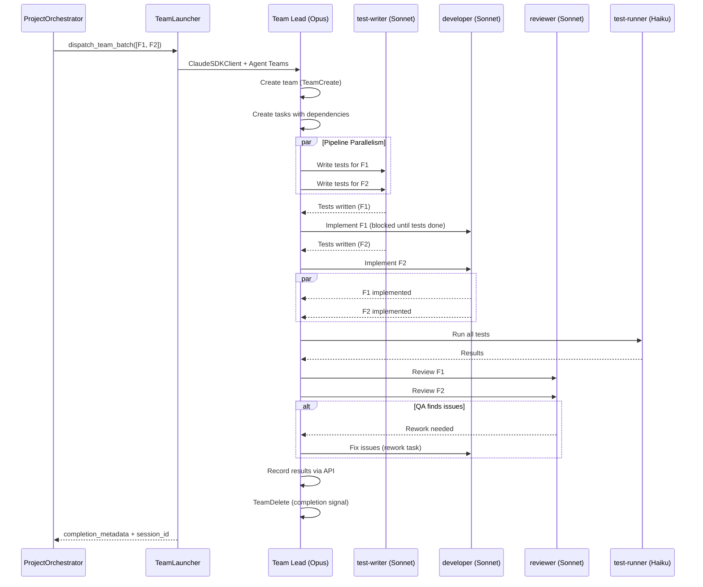
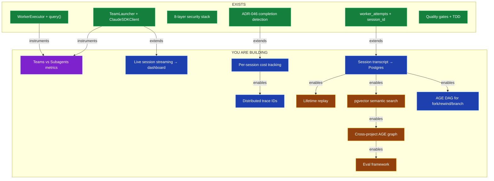

# BHappy ↔ SDK Integration Map — Visual Reference

## Current Architecture

## What You're Building (TC1-TC4)

## Teams vs Subagents: Current BHappy Flow

## What's Missing (Your Curriculum Fills These Gaps)

