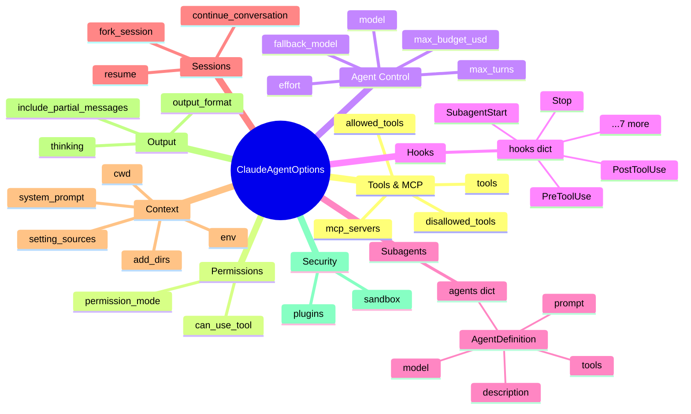
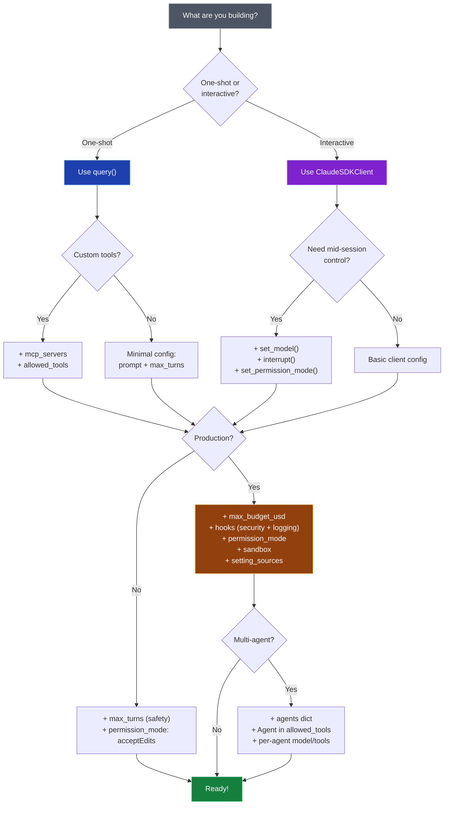
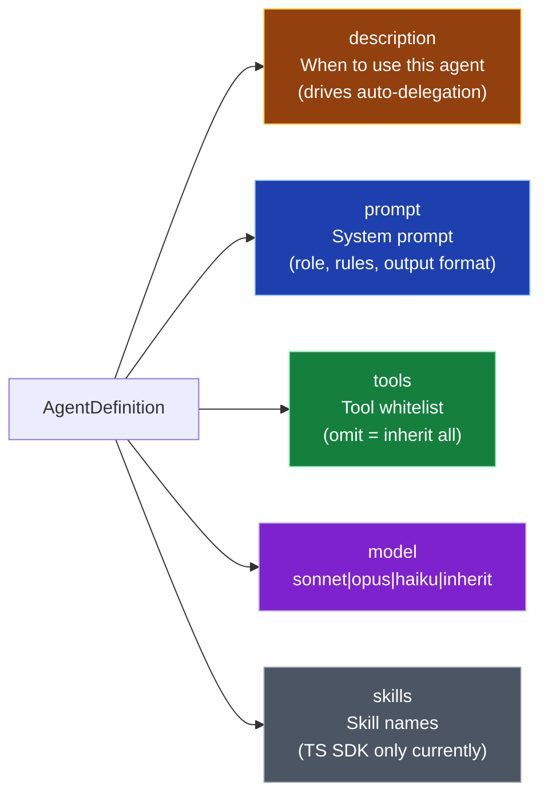

# ClaudeAgentOptions — Visual Map

## Option Groups



## Decision Guide: Which Options Do I Need?



## Minimal Configs by Use Case

### Batch Script
```python
ClaudeAgentOptions(
    allowed_tools=["Read", "Grep", "Glob"],
    max_turns=10,
    max_budget_usd=0.50,
)
```

### Autonomous Developer (BHappy Worker)
```python
ClaudeAgentOptions(
    model="claude-sonnet-4-6",
    allowed_tools=["Read", "Write", "Edit", "Bash", "Grep", "Glob"],
    permission_mode="acceptEdits",
    setting_sources=["project"],
    plugins=[{"type": "local", "path": "/app/skills/..."}],
    max_turns=500,
    max_budget_usd=5.0,
    hooks={"PreToolUse": [HookMatcher(matcher="Bash", hooks=[bash_security])]},
    sandbox=SandboxSettings(enabled=True),
)
```

### Agent Team Lead (BHappy TeamLauncher)
```python
ClaudeAgentOptions(
    model="claude-opus-4-6",
    system_prompt={"type": "preset", "preset": "claude_code", "append": team_prompt},
    allowed_tools=["Bash", "Read", "Write", "Edit", "Grep", "Glob",
                   "Task", "SendMessage", "TeamCreate", "TeamDelete",
                   "TaskCreate", "TaskList", "TaskUpdate", "TaskGet", "Skill"],
    permission_mode="acceptEdits",
    setting_sources=["project"],
    plugins=[{"type": "local", "path": skills_path}],
    hooks={
        "PreToolUse": [HookMatcher(matcher="Bash", hooks=[bash_security])],
        "PostToolUse": [HookMatcher(matcher="TeamDelete", hooks=[on_team_delete])],
        "SubagentStart": [HookMatcher(hooks=[on_agent_start])],
        "SubagentStop": [HookMatcher(hooks=[on_agent_stop])],
        "Stop": [HookMatcher(hooks=[on_stop])],
    },
    extra_args={"teammate-mode": "in-process"},
    env={"CLAUDE_CODE_EXPERIMENTAL_AGENT_TEAMS": "1"},
)
```

### Session Inspector (Read-only)
```python
ClaudeAgentOptions(
    mcp_servers={"sessions": session_query_server},
    allowed_tools=["Read", "Grep", "Glob",
                   "mcp__sessions__search", "mcp__sessions__get_chain"],
    max_turns=20,
    max_budget_usd=1.0,
    output_format={"type": "json_schema", "schema": report_schema},
)
```

## AgentDefinition Fields


