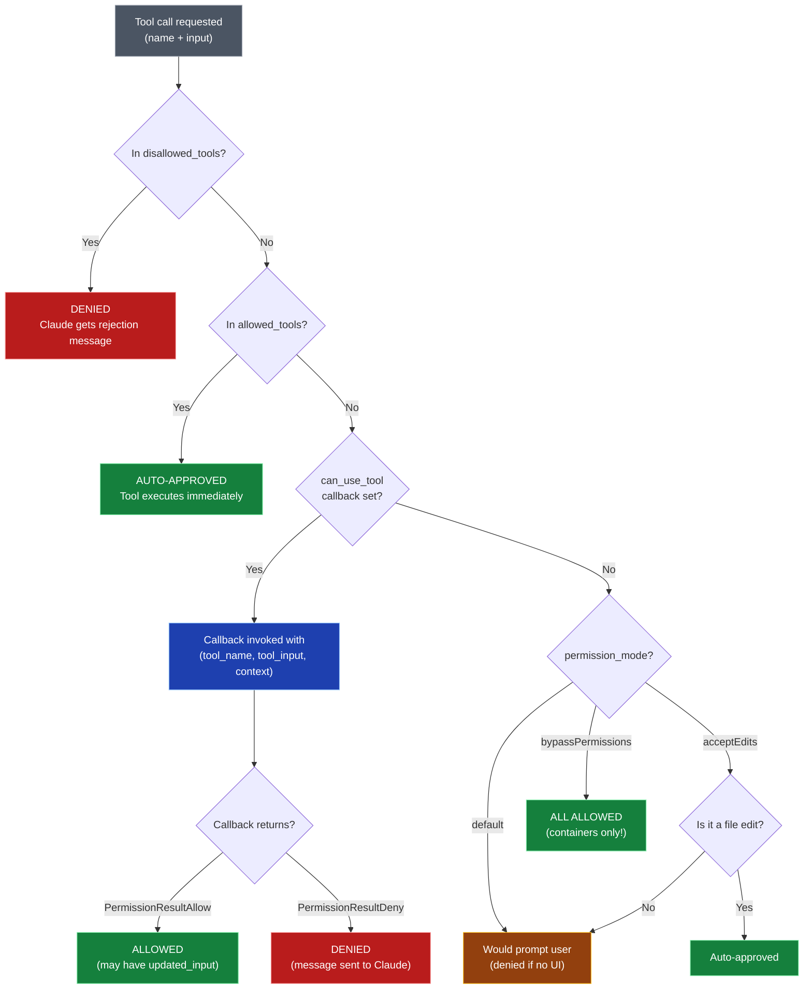
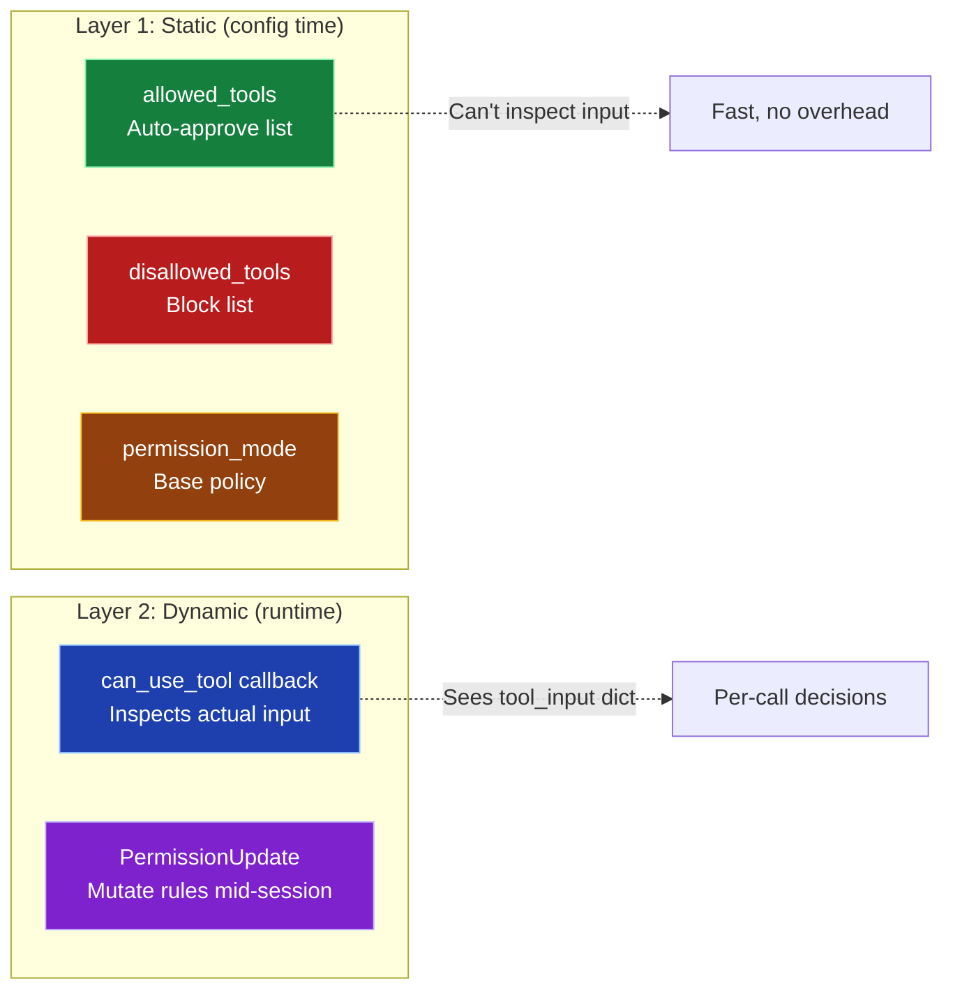
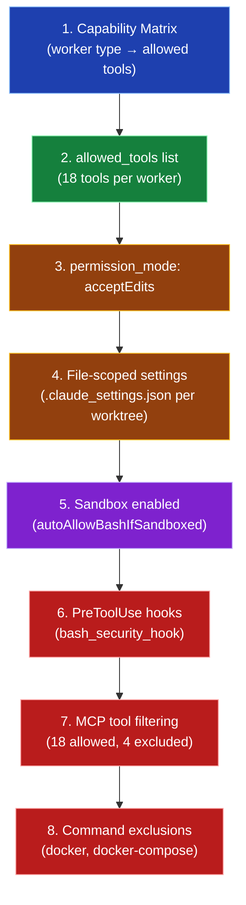

# Permission System — Visual Reference

## Decision Flow: "Can this tool run?"



## The Two-Layer Model



## Scoped Tool Rules

```
allowed_tools examples:

"Read"                    → Allow all Read calls
"Bash(npm:*)"             → Allow Bash only for npm commands
"Bash(git:*)"             → Allow Bash only for git commands
"Edit(/app/worktrees/**)" → Allow Edit only in worktrees
"Write|Edit|MultiEdit"    → Allow all write-type tools

Hook matcher patterns (same syntax):
HookMatcher(matcher="Bash")           → Match all Bash calls
HookMatcher(matcher="Write|Edit")     → Match write tools
HookMatcher(matcher=None)             → Match ALL tools
```

## BHappy Permission Stack (8 Layers)



## PermissionResult Types

```
PermissionResultAllow(
    updated_input=None,           # Optional: modify the tool input
    updated_permissions=None      # Optional: add/remove permission rules
)

PermissionResultDeny(
    message="Reason shown to Claude",  # Claude sees this and adjusts
    interrupt=False                     # True = stop the entire session
)
```
