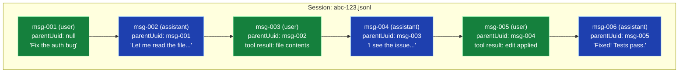
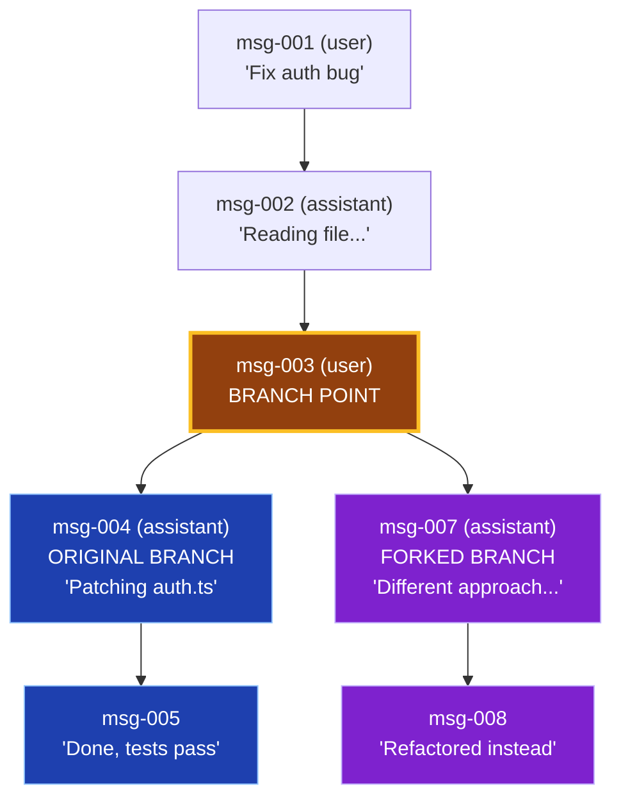
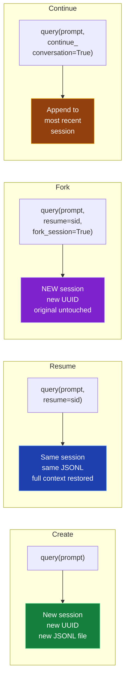
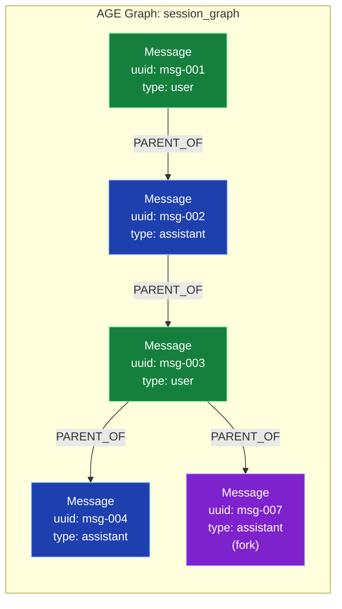
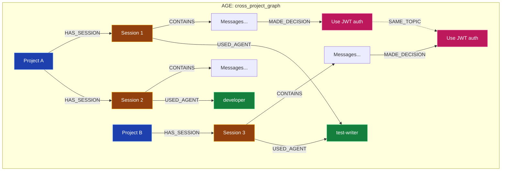

# Session Storage & DAG Structure — Visual Reference

## JSONL → parentUuid Tree



## Fork at Turn 3: Two Branches, One File



```
Both branches coexist in the same JSONL file.
msg-007.parentUuid = msg-003.uuid  ← branches from turn 3
msg-004.parentUuid = msg-003.uuid  ← original continues from turn 3

get_session_messages() follows the LONGEST/LATEST chain.
To get the fork: walk from msg-008 back via parentUuid.
```

## SDK Session Operations



## File System Layout

```
~/.claude/
├── projects/
│   ├── -Users-john-myproject/          ← sanitized cwd
│   │   ├── abc-123-def-456.jsonl       ← session transcript
│   │   ├── ghi-789-jkl-012.jsonl       ← another session
│   │   └── ...
│   └── -Users-john-otherproject/
│       └── ...
├── settings.json
└── ...
```

## AGE Graph Model (for Postgres backend)



## Key AGE Queries

```sql
-- Reconstruct conversation to a specific message (ancestors)
SELECT * FROM cypher('session_graph', $$
    MATCH path = (root)-[:PARENT_OF*]->(target {uuid: 'msg-004'})
    WHERE NOT EXISTS(()-[:PARENT_OF]->(root))
    RETURN [n IN nodes(path) | n.uuid] AS chain
$$) AS (chain agtype);

-- Find all branch points (messages with >1 child)
SELECT * FROM cypher('session_graph', $$
    MATCH (parent)-[:PARENT_OF]->(child)
    WITH parent, count(child) AS branches
    WHERE branches > 1
    RETURN parent.uuid, branches
$$) AS (uuid agtype, branches agtype);

-- Extract a fork subtree (descendants of a branch point)
SELECT * FROM cypher('session_graph', $$
    MATCH (start {uuid: 'msg-003'})-[:PARENT_OF*]->(desc)
    RETURN desc.uuid, desc.type
    ORDER BY desc.uuid
$$) AS (uuid agtype, type agtype);
```

## Cross-Project Session Model (TC4 target)


