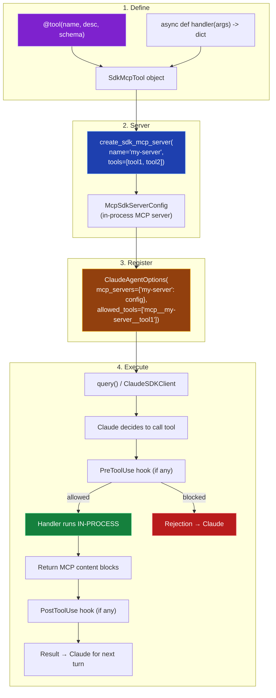
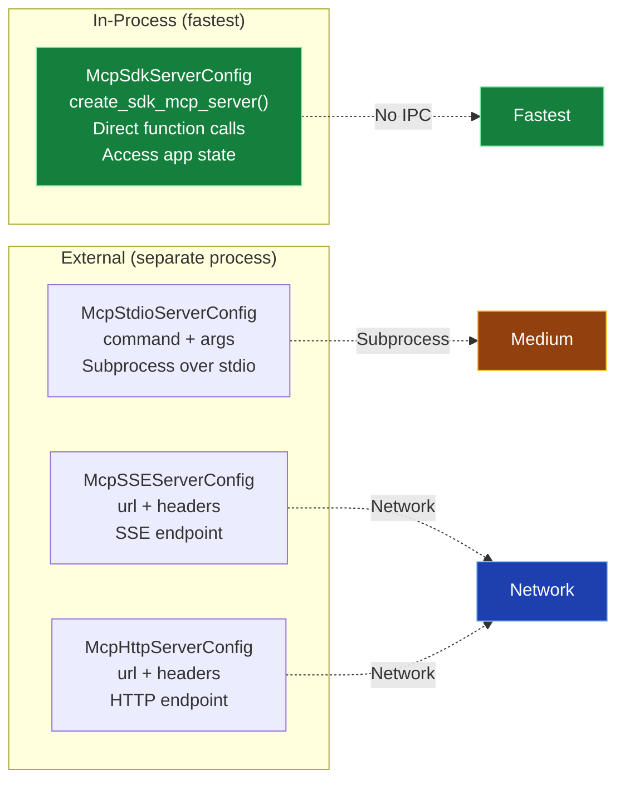
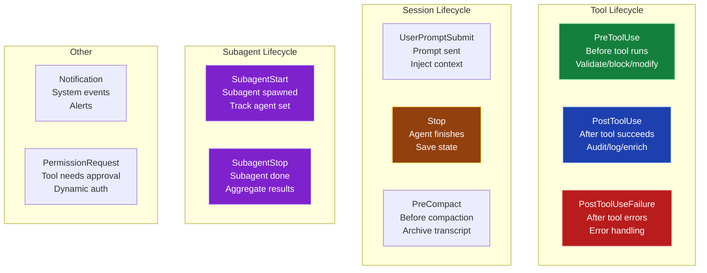
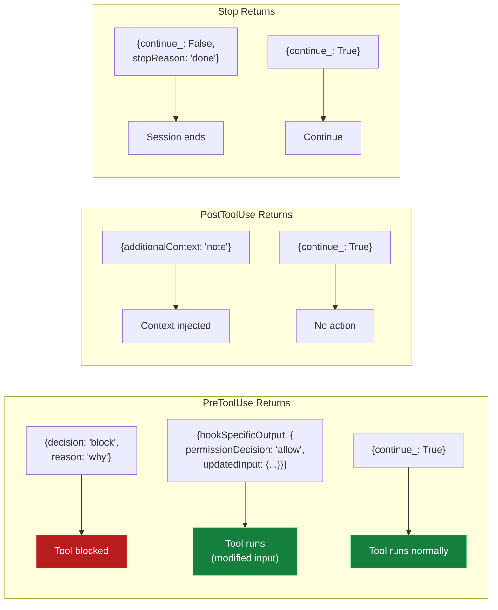
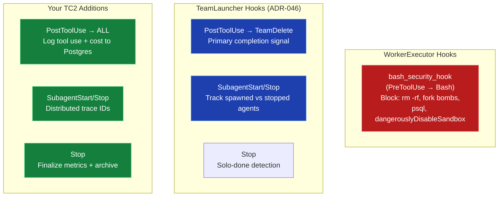

# Tool Pipeline & Hook System — Visual Reference

## Tool Creation → Registration → Execution



## Tool Naming Convention

```
create_sdk_mcp_server(name="db-tools", tools=[query_db, insert_record])
                            ▲                     ▲           ▲
                            │                     │           │
                     server name            tool name    tool name
                            │                     │           │
                            ▼                     ▼           ▼
allowed_tools = ["mcp__db-tools__query_db", "mcp__db-tools__insert_record"]
                  ^^^^  ^^^^^^^^^  ^^^^^^^^
                  prefix  server    tool
```

## MCP Server Types



## Hook Execution Points in the Agent Loop

```mermaid
sequenceDiagram
    participant Loop as Agent Loop
    participant Pre as PreToolUse
    participant Tool as Tool Execution
    participant Post as PostToolUse
    participant Stop as Stop/SubagentStop

    Note over Loop: Turn starts

    Loop->>Pre: Hook fires BEFORE tool runs
    alt Hook blocks
        Pre-->>Loop: {decision: "block", reason: "..."}
        Note over Loop: Tool skipped, reason sent to Claude
    else Hook allows
        Pre-->>Loop: {continue_: True}
        Loop->>Tool: Execute tool
        Tool-->>Loop: Tool result
        Loop->>Post: Hook fires AFTER tool completes
        Post-->>Loop: {additionalContext: "..."} (optional)
    end

    Note over Loop: ... more turns ...

    Loop->>Stop: Hook fires when agent finishes
    Note over Stop: Save state, archive transcript, log metrics
```

## All Hook Events



## HookMatcher Configuration

```python
# Match specific tool
HookMatcher(matcher="Bash", hooks=[bash_hook])

# Match multiple tools
HookMatcher(matcher="Write|Edit|MultiEdit", hooks=[write_hook])

# Match ALL tools (matcher=None)
HookMatcher(matcher=None, hooks=[logging_hook])

# Multiple matchers on same event
hooks = {
    "PreToolUse": [
        HookMatcher(matcher="Bash", hooks=[bash_security]),
        HookMatcher(matcher=None, hooks=[universal_logger])
    ],
    "PostToolUse": [
        HookMatcher(matcher=None, hooks=[cost_tracker])
    ],
    "Stop": [
        HookMatcher(hooks=[save_state])
    ]
}
```

## Hook Return Values



## BHappy Hook Architecture


