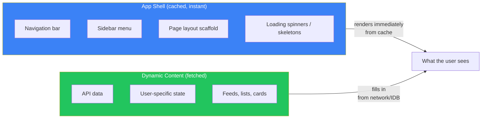
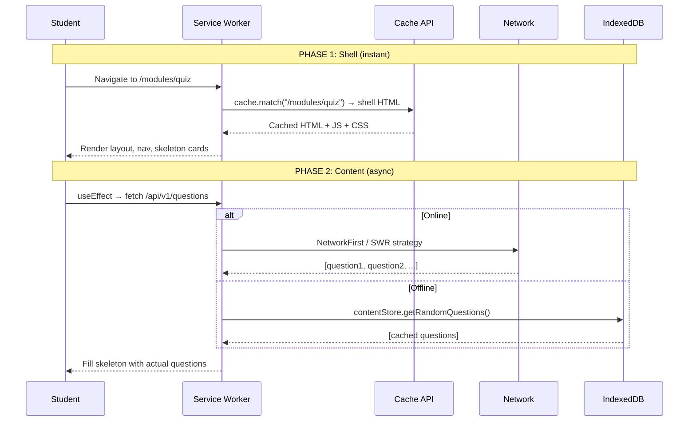
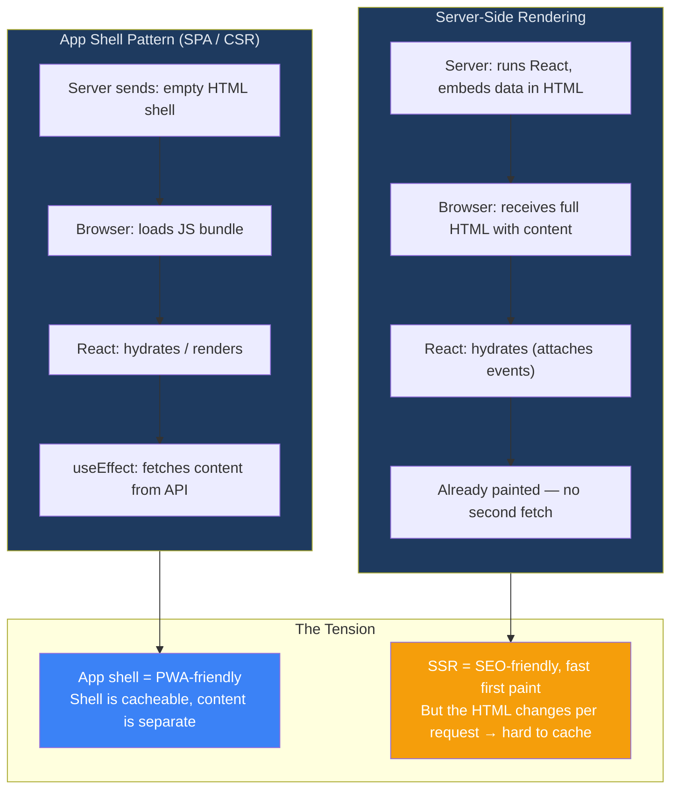
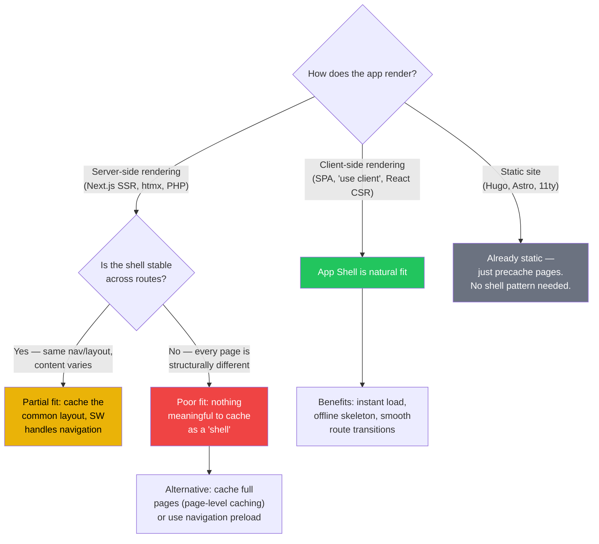
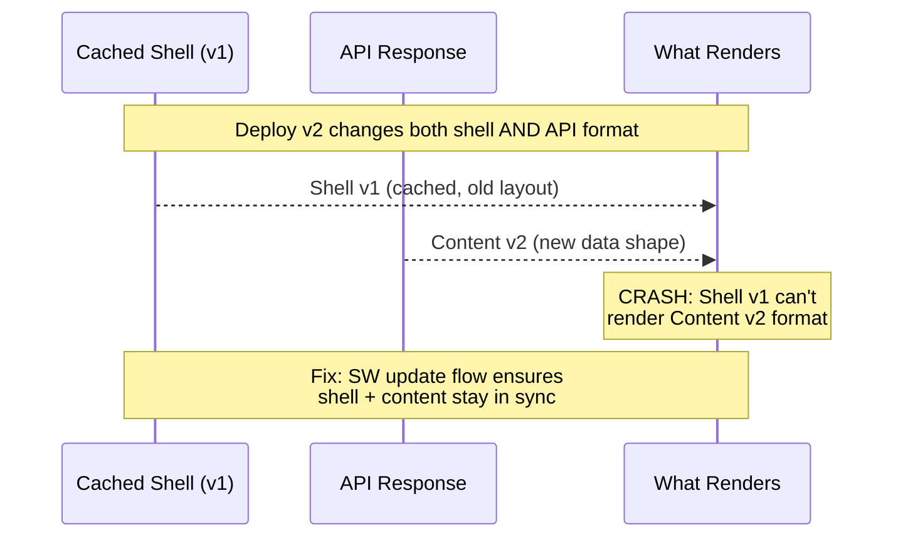

# App Shell Pattern: Visual Reference

*The architectural pattern that makes PWAs feel instant — and when it doesn't fit.*

---

## What Is the App Shell?

The **app shell** is the minimal HTML + CSS + JS needed to render the UI **skeleton** — navigation, layout, loading states — without any content data. It's the "chrome" of your app.



**The deal:** Cache the shell aggressively (cache-first or precache). Fetch content separately. The user sees *something* instantly, even offline, even on slow 3G.

---

## How It Works: The Two-Phase Load



**Phase 1** is why PWAs feel fast — the shell is precached during SW install. No network round-trip.
**Phase 2** is where your caching strategy decisions matter — and where IDB enters the picture for offline.

---

## App Shell vs Server-Side Rendering: The Tradeoff



### Why this matters for StudyElf

Your Session 2 discovery: StudyElf uses `"use client"` everywhere — the server only produces empty shells. This means **you're already doing the app shell pattern** without calling it that. The `standalone → export` migration makes it explicit: pre-built HTML shells served from CDN, content fetched client-side.

---

## When App Shell Fits vs Doesn't



### Decision matrix

| App Architecture | App Shell Fit | Why | Cache Strategy |
|---|---|---|---|
| **SPA / CSR** (React, Vue, Angular) | Excellent | Single HTML entry point + JS bundle = natural shell | Precache shell; runtime cache API data |
| **Next.js `output: 'export'`** (your case) | Excellent | Static HTML shells per route; all rendering client-side | Precache shells; SWR/NetworkFirst for API |
| **Next.js `standalone` (SSR)** | Moderate | HTML varies per request, but layout is shared | Cache layout assets; navigation preload for pages |
| **htmx / server-rendered** | Poor | Server returns full HTML with data embedded; no clean shell/content split | Cache full pages or use SWR on HTML responses |
| **Static site** | Unnecessary | Pages are already static files — just precache them directly | Precache all pages |

---

## App Shell Failure Modes

These are the things that go wrong when you implement the pattern:

### 1. Shell-Content Version Mismatch



**Prevention:** The SW update flow you designed in Session 3 (waiting state → toast → SKIP_WAITING → reload) ensures the shell updates atomically with the new code.

### 2. Empty Shell Offline (No Content Cached)

```
Student goes offline → sees shell (nav, layout) → content area is empty
→ "No offline content available" message (Edge Case #1 in your plan)
```

This is exactly why your plan adds the "Prepare for Offline Study" download and write-through IDB cache — the shell alone isn't useful without cached content to fill it.

### 3. Flash of Loading State (FOLS)

On fast connections, the two-phase load creates a visible flash: shell appears → spinner → content fills in. On slow connections this is desirable (progressive rendering). On fast connections it's janky.

**Mitigation:** Keep the shell-to-content transition under 100ms on fast networks. Your SWR strategy with write-through IDB means returning users almost always get instant content from cache.

---

## Quick Reference

| Concept | One-liner |
|---|---|
| App Shell | Minimal HTML/CSS/JS skeleton — no content data |
| Two-phase load | Shell from cache (instant), content from network/IDB (async) |
| Precaching | SW downloads shell during install, before any user request |
| Shell + CSR | Natural partners — React SPA IS an app shell |
| Shell + SSR | Tension — server-rendered HTML embeds data, hard to separate |
| Version mismatch | Old shell + new API = crash. SW update flow prevents this. |
| StudyElf fit | Already app-shell by architecture (`use client` + `output: export`) |
