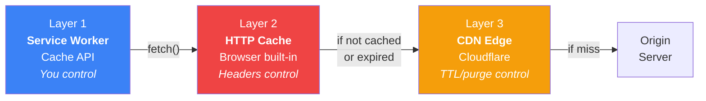
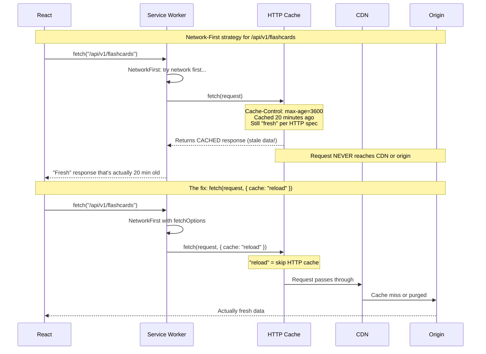
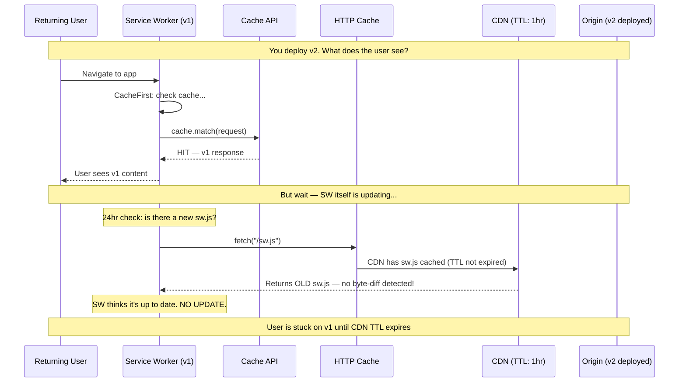
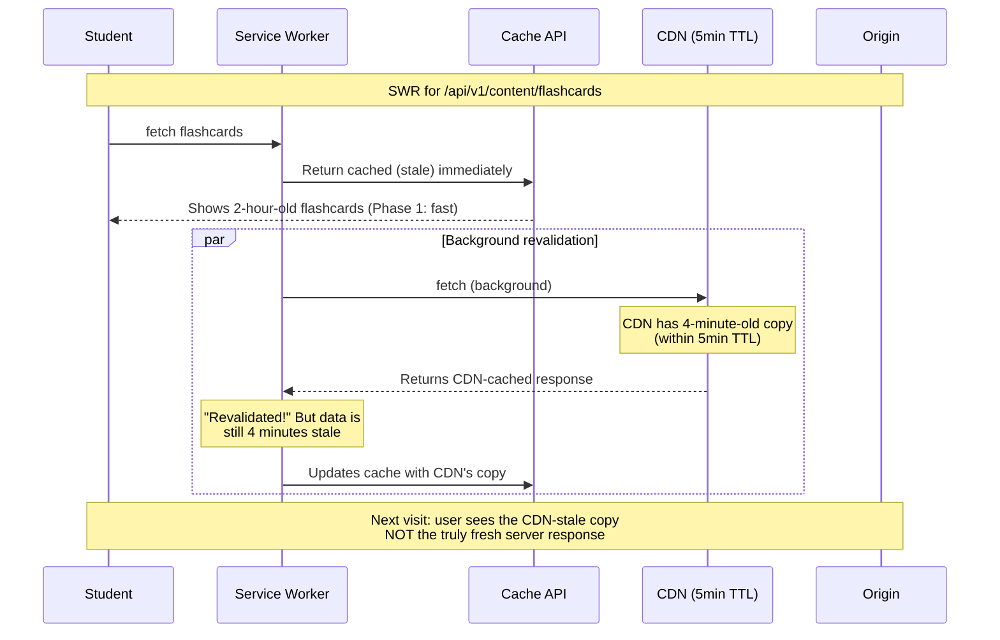
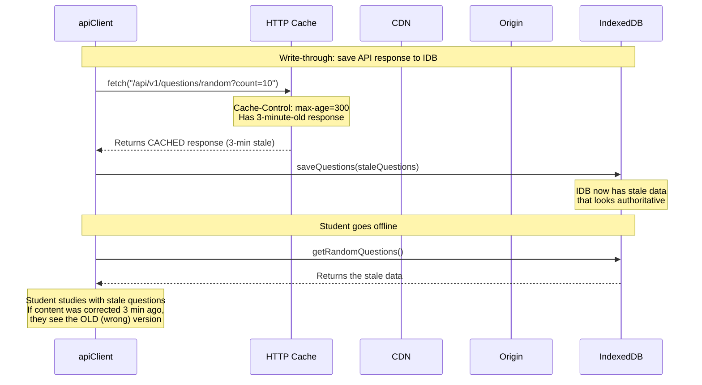

# Cache Layer Compounding: When Caches Stack Against You

*The three-layer interaction problems that catch even experienced developers. This is TC-2's hard content.*

---

## The Three Layers (Recap)



Each layer operates **independently**. A request can be intercepted at any layer. The problem: when you think you're reaching the origin, you might be getting a cached copy from a layer you forgot about.

---

## Problem 1: Network-First + HTTP Cache = Stale "Fresh" Data

This is the productive failure from your learning plan — the naive theory that "network-first means fresh."



### When does this bite you?

**Only when ALL of these are true:**
1. Your SW uses NetworkFirst or SWR (strategies that hit the network)
2. Your server sends `Cache-Control` with `max-age > 0`
3. The HTTP cache has a recent copy

**StudyElf risk:** If your FastAPI backend sends `Cache-Control: max-age=300` on content endpoints, NetworkFirst will serve 5-minute-stale data and think it's fresh. The `fetchOptions: { cache: 'reload' }` in your Serwist config fixes this.

---

## Problem 2: Cache-First + CDN TTL on Deploy



### The timeline

```
T=0:     Deploy v2 to origin
T=0-60m: CDN still serving v1 of sw.js (TTL not expired)
         → SW byte-diff check finds no change
         → No update triggered
         → Cache-first keeps serving v1 content
T=60m:   CDN TTL expires, next check gets v2 sw.js
         → SW detects byte-diff
         → Installs new SW, enters waiting state
T=60m+:  User navigates or 24hr check triggers
         → Update toast appears → reload → v2 active
```

**Worst case:** CDN TTL (1hr) + SW check interval (24hr) = **up to 25 hours** before update reaches user.

### Fixes

| Approach | How | Tradeoff |
|---|---|---|
| **Short TTL on sw.js** | `Cache-Control: max-age=0` on service worker file only | CDN always passes through for sw.js; tiny file, minimal cost |
| **CDN purge on deploy** | API call to purge `/sw.js` after each deploy | Requires CI/CD integration |
| **Both** (recommended) | Short TTL + purge as safety net | Belt and suspenders |

**Important:** Short TTL on `sw.js` does NOT mean short TTL on everything. Your hashed JS/CSS bundles can have `max-age=31536000` (1 year) because the URL changes with every deploy.

---

## Problem 3: SWR + CDN = Double Staleness



### The staleness math

```
Total staleness = SW cache age + CDN TTL remaining

Worst case:
  SW cached 2 hours ago (no visit since)
  + CDN TTL has 5 minutes left
  = User sees 2-hour-old data on first paint
  = Revalidation fetches 5-minute-old data from CDN
  = Next visit shows 5-minute-old data (improved but still stale)
```

**Is this a problem?** Depends on content type:

| Content | 5-min staleness | 2-hour staleness |
|---|---|---|
| Drug card content | Acceptable | Acceptable (rarely changes) |
| Flashcard list | Acceptable | Acceptable |
| Leaderboard / scores | Noticeable | Unacceptable — use NetworkFirst |
| Corrected pharmacology error | Unacceptable | Unacceptable — purge CDN |

---

## Problem 4: Write-Through Cache + HTTP Cache (Your Plan's Risk)

This is Issue #5 from the plan review — the Session 3 callback.



### Why this matters more for write-through than normal caching

With normal SW caching, stale data is replaced on next network fetch. With write-through to IDB, stale data gets **persisted into a different storage layer** that has no automatic expiry. It can live in IDB for days (until the next write-through or explicit download overwrites it).

### Fix

For the download manager specifically (where freshness matters most):

```typescript
// Download manager: bypass HTTP cache
const response = await fetch(url, { cache: "no-cache" })
// "no-cache" = still uses HTTP cache but revalidates with server first
// "reload" = skips HTTP cache entirely
```

For normal write-through (user browsing online): `max-age=300` staleness is acceptable — the data refreshes on next visit anyway.

---

## Summary: Layer Interaction Quick Reference

| Scenario | Layers Involved | Problem | Fix |
|---|---|---|---|
| NetworkFirst serves stale | SW + HTTP Cache | HTTP cache intercepts before network | `fetch({ cache: 'reload' })` |
| Deploy doesn't reach users | SW + CDN | CDN caches old sw.js | Short TTL on sw.js + purge |
| SWR revalidation is stale | SW + CDN | Background fetch hits CDN, not origin | Accept (low stakes) or purge (high stakes) |
| Write-through persists stale | HTTP Cache + IDB | HTTP cache → stale response → saved to IDB | `{ cache: 'no-cache' }` on downloads |
| All three compound | SW + HTTP + CDN | Cache-first + max-age + CDN TTL = stuck | Content-hash URLs (bypass all three) |

### The universal escape hatch

**Content-hashed URLs** (`main.a3f8c2.js`) bypass the compounding problem entirely — every layer correctly caches forever because the URL itself changes when the content changes. The problems above only affect **mutable URLs** (API endpoints, unhashed HTML, `sw.js`).
