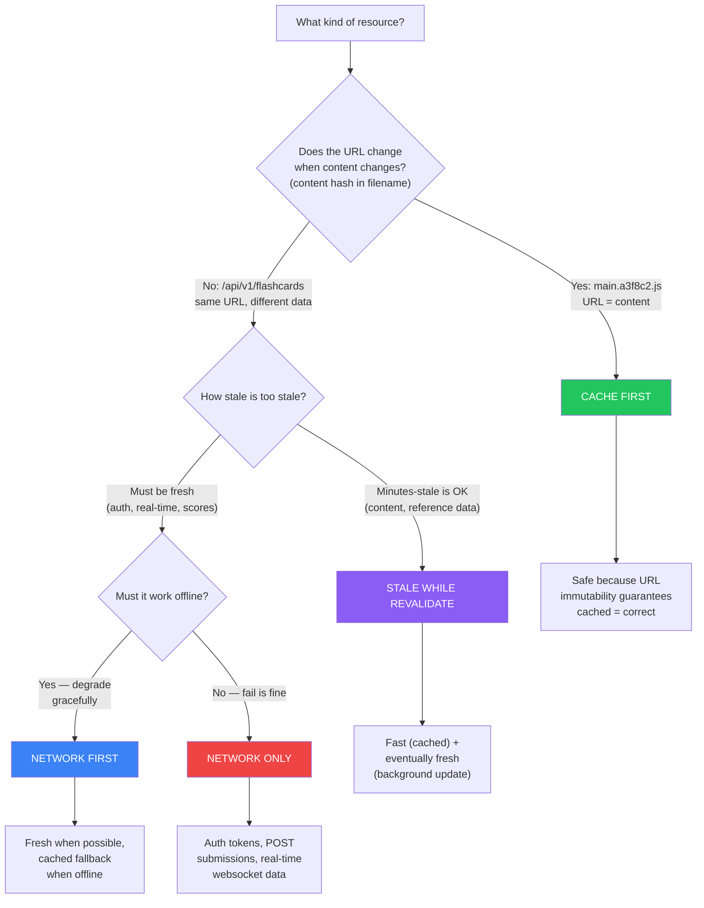
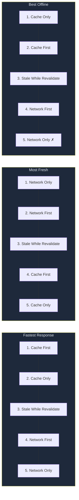

# Caching Strategy Selection: Decision Framework

*How to assign the right caching strategy to any resource type in any app — the systematic approach.*

---

## The Decision Tree

For each resource type in an app, walk this tree:



### The Fifth Strategy: Cache Only

Not in the main tree because it's a special case — **pre-downloaded content packs** that you explicitly manage:

```
Downloaded "Pharmacology 101 Pack" → stored in IDB/Cache API
→ Cache Only: never check network, serve from local store
→ Update only via explicit re-download
```

---

## Strategy Properties Cheat Sheet



**The fundamental tradeoff:** Speed ↔ Freshness. No strategy gives you both perfectly. Your job is to match each resource to its tolerance.

---

## Applying the Framework: Worked Example

### Scenario: Recipe Sharing App

| Resource | URL Changes? | Staleness Tolerance | Offline Need | Strategy | Rationale |
|---|---|---|---|---|---|
| JS/CSS bundles | Yes (hashed) | N/A (immutable) | Must load | **Cache First** | URL = content; safe forever |
| Recipe images | Yes (CDN hash) | N/A | Nice to have | **Cache First** | Content-addressed; large, slow to re-fetch |
| Recipe list API | No (`/api/recipes`) | Minutes OK | Yes | **SWR** | Show cached list fast; update in background |
| Recipe detail | No (`/api/recipes/42`) | Minutes OK | Yes | **SWR** | Same logic; user wants to see recipe offline |
| User profile | No (`/api/me`) | Must be fresh | No | **Network First** | Auth-dependent; stale profile = wrong permissions |
| Recipe submission | N/A (POST) | N/A | Queue offline | **Network Only** + queue | POST = side effect; queue in IDB for sync |
| Auth tokens | N/A | Must be fresh | No | **Network Only** | Never cache credentials |
| App shell HTML | No (`/index.html`) | Per-deploy OK | Must load | **Precache** | Updated atomically with SW |

---

## The Three Questions for Any Resource

When you encounter a resource type you haven't seen before, ask:

```
1. CAN I cache it safely?
   → Is the URL immutable (content hash)?
   → Does it contain user-specific or auth-sensitive data?
   → Is it a side effect (POST/PUT/DELETE)?

2. SHOULD I cache it?
   → How often does it change?
   → What's the cost of showing stale data? (Annoyance? Wrong answer? Security risk?)
   → What's the cost of NOT caching? (Slow load? Offline failure?)

3. HOW should I cache it?
   → Use the decision tree above
   → Then check: does this interact with HTTP cache or CDN? (next reference)
```

---

## Common Mistakes

| Mistake | Why It's Wrong | Fix |
|---|---|---|
| Cache-first on non-hashed URLs | Same URL, new content = serving stale forever | Use SWR or Network First |
| Network-first on static assets | Unnecessary network round-trip every time | Cache First (they're immutable) |
| SWR on auth endpoints | User sees stale permissions, then they change | Network First or Network Only |
| Network Only on everything | App is useless offline | Only for POSTs and auth |
| Cache Only without update path | Content rots forever | Pair with explicit re-download |
| Ignoring POST/PUT/DELETE | These have side effects — caching is meaningless | Network Only + offline queue |

---

## Quick Reference: Strategy Selection by Resource Type

| Resource Type | Typical Strategy | Key Signal |
|---|---|---|
| Hashed JS/CSS/images | Cache First | URL contains content hash |
| App shell HTML | Precache (install-time) | Updated only on deploy |
| API: read-heavy content | Stale While Revalidate | Tolerance for minutes-stale |
| API: user-specific data | Network First | Must reflect current state |
| API: real-time / scores | Network First or Only | Staleness = wrong answers |
| API: write operations | Network Only + IDB queue | Side effects can't be cached |
| Fonts / third-party CDN | Cache First | Immutable, large, slow |
| Auth tokens / sessions | Network Only | Never cache |
| Downloaded content packs | Cache Only | Explicit user-managed |
