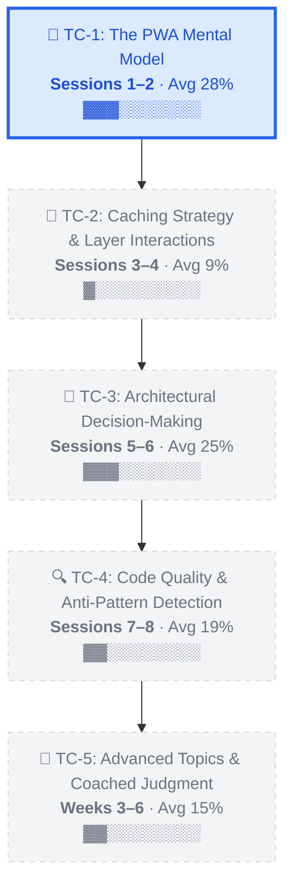
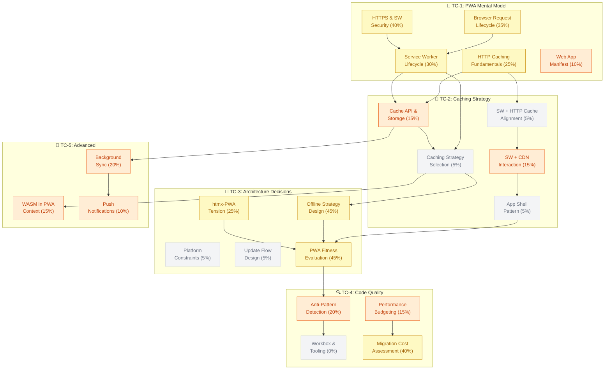

# PWA Learning Roadmap

> *8-hour sprint (Sessions 1–8) + Extended mastery program*

---

## Overall Coverage: ~19%

```
Progress: ██████░░░░░░░░░░░░░░░░░░░░░░░░░░  19%
          ▲ 22 vertices across 5 task classes
```

---

## Timeline

```
┌──────────────────┬──────────────────┬──────────────────┬──────────────────┐
│    ◆ WEEK 1      │     WEEK 2       │   WEEKS 3–4      │   WEEKS 5–6      │
│   Sessions 1–4   │   Sessions 5–8   │    Advanced       │    Coached       │
│   ← YOU ARE HERE │                  │                   │                  │
└──────────────────┴──────────────────┴──────────────────┴──────────────────┘
```

---

## Dependency Flow



---

## Task Class 1: 🧠 The PWA Mental Model

**Status:** `▶ IN PROGRESS` · **Sessions 1–2**

*Request lifecycle, service worker basics, manifest, HTTPS. Anchored to your backend HTTP experience.*

### Skills

| Skill | Mastery | Status |
|---|---|---|
| HTTP Caching Fundamentals | `▓▓▓░░░░░░░` 25% | Attempted |
| Browser Request Lifecycle | `▓▓▓▓░░░░░░` 35% | Attempted |
| Service Worker Lifecycle | `▓▓▓░░░░░░░` 30% | Attempted |
| Web App Manifest | `▓░░░░░░░░░` 10% | Attempted |
| HTTPS & SW Security | `▓▓▓▓░░░░░░` 40% | Familiar |

### Task Sequence

| | Task | Status |
|:---:|---|:---:|
| ✅ | Worked Example: Full PWA evaluation of StudyElf | **Done** |
| ▶ | Completion: Fill in cache layer behaviors per resource type | **Current** |
| 🔒 | Guided: Trace requests through all layers yourself | Locked |
| 🔒 | Independent: Evaluate a content blog for PWA | Locked |

> **🏁 Mastery Gate:** Trace requests through 6 cache layers. Explain SW lifecycle phases. Identify manifest installability requirements.

---

## Task Class 2: 💾 Caching Strategy & Layer Interactions

**Status:** `🔒 LOCKED` · **Sessions 3–4**

*Five caching strategies, strategy selection per resource, SW+HTTP cache alignment, SW+CDN double-cache problem, app shell pattern.*

### Skills

| Skill | Mastery | Status |
|---|---|---|
| Cache API & Storage | `▓▓░░░░░░░░` 15% | Attempted |
| Caching Strategy Selection | `▓░░░░░░░░░` 5% | Not Started |
| SW + HTTP Cache Alignment | `▓░░░░░░░░░` 5% | Not Started |
| SW + CDN Interaction | `▓▓░░░░░░░░` 15% | Attempted |
| App Shell Pattern | `▓░░░░░░░░░` 5% | Not Started |

### Task Sequence

| | Task | Status |
|:---:|---|:---:|
| 🔒 | Worked Example: Complete caching architecture walkthrough | Locked |
| 🔒 | Completion: Assign strategies for 3 of 6 resource types | Locked |
| 🔒 | Guided: App shell pattern analysis (SPA vs htmx) | Locked |
| 🔒 | Independent: Full caching architecture design | Locked |

> **🏁 Mastery Gate:** Assign caching strategies with rationale. Predict SW+CDN deploy behavior. Spot the "network-first hits HTTP cache" trap.

> **⚠️ Expected Plateau:** Caching illusion of competence: strategies feel simple until multi-layer interactions produce surprises.

---

## Task Class 3: 🎯 Architectural Decision-Making

**Status:** `🔒 LOCKED` · **Sessions 5–6**

*PWA fitness evaluation framework, offline strategy tiers, platform constraints (iOS!), htmx-PWA tension, update flow design.*

### Skills

| Skill | Mastery | Status |
|---|---|---|
| Offline Strategy Design | `▓▓▓▓▓░░░░░` 45% | Familiar |
| Platform Constraints | `▓░░░░░░░░░` 5% | Not Started |
| Update Flow Design | `▓░░░░░░░░░` 5% | Not Started |
| htmx-PWA Tension | `▓▓▓░░░░░░░` 25% | Attempted |
| PWA Fitness Evaluation | `▓▓▓▓▓░░░░░` 45% | Familiar |

### Task Sequence

| | Task | Status |
|:---:|---|:---:|
| 🔒 | Worked Example: Evaluate 3 contrasting apps | Locked |
| 🔒 | Completion: Finish a partial evaluation | Locked |
| 🔒 | Guided: Evaluate YOUR app for PWA fitness | Locked |
| 🔒 | Independent: Novel app evaluation + challenge | Locked |

> **🏁 Mastery Gate:** Produce structured go/no-go PWA recommendation independently. Reasoning survives challenge.

> **⚠️ Expected Plateau:** Component-to-system gap: pieces known individually, hard to integrate into coherent evaluation.

---

## Task Class 4: 🔍 Code Quality & Anti-Pattern Detection

**Status:** `🔒 LOCKED` · **Sessions 7–8**

*Workbox as quality baseline, LLM-generated SW anti-patterns, performance diagnostics, migration cost assessment. Plugs into your PR review pipeline.*

### Skills

| Skill | Mastery | Status |
|---|---|---|
| Workbox & Tooling | `░░░░░░░░░░` 0% | Not Started |
| Anti-Pattern Detection | `▓▓░░░░░░░░` 20% | Attempted |
| Performance Budgeting | `▓▓░░░░░░░░` 15% | Attempted |
| Migration Cost Assessment | `▓▓▓▓░░░░░░` 40% | Attempted |

### Task Sequence

| | Task | Status |
|:---:|---|:---:|
| 🔒 | Worked Example: Compare 3 SW implementations | Locked |
| 🔒 | Completion: Find remaining 3 of 6 anti-patterns | Locked |
| 🔒 | Guided: Full PWA quality assessment | Locked |
| 🔒 | Mastery Gate: Independent review + challenge | Locked |

> **🏁 Mastery Gate:** Identify anti-patterns in LLM-generated SW code. Recommend Workbox alternatives. Produce migration cost/benefit analysis.

---

## Task Class 5: 🚀 Advanced Topics & Coached Judgment

**Status:** `🔒 LOCKED` · **Extended (Weeks 3–6)**

*WASM+PWA, push notifications, background sync. Repeated coached judgment with ambiguous scenarios. Portfolio evaluation capstone.*

### Skills

| Skill | Mastery | Status |
|---|---|---|
| WASM in PWA Context | `▓▓░░░░░░░░` 15% | Attempted |
| Push Notifications | `▓░░░░░░░░░` 10% | Attempted |
| Background Sync | `▓▓░░░░░░░░` 20% | Attempted |

### Task Sequence

| | Task | Status |
|:---:|---|:---:|
| 🔒 | Worked Example: WASM + Push + Sync walkthrough | Locked |
| 🔒 | Guided: Complex scenario with all advanced topics | Locked |
| 🔒 | Independent: 3 ambiguous scenario evaluations | Locked |
| 🔒 | Capstone: Evaluate YOUR remaining applications | Locked |

> **🏁 Mastery Gate:** Rapid evaluation of ambiguous scenarios integrating all topics. Portfolio-level recommendations.

---

## Skill Mastery Knowledge Graph



**Legend:** 🟢 Mastered (≥80%) · 🟡 Developing (30–59%) · 🟠 Beginner (10–29%) · ⬜ Not Started (<10%)

---

## Competence Milestones

| Target | Milestone | Status |
|---|---|:---:|
| **End Session 2** | Trace requests through all 6 cache layers from memory | ⬜ |
| **End Session 4** | Assign caching strategies to 5 resource types in under 5 min | ⬜ |
| **End Session 7** | Produce go/no-go PWA recommendation for novel app in 15 min | ⬜ |
| **End Session 8** | Identify 5+ anti-patterns in LLM-generated service worker | ⬜ |

---

*PWA Curriculum Roadmap · 22 vertices across 5 task classes · Updated after Session 1*
