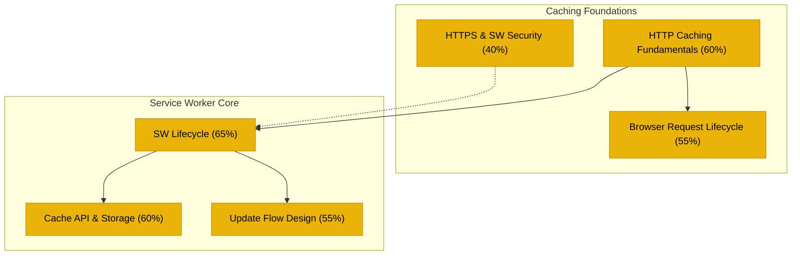
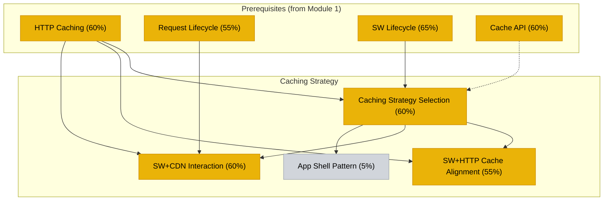
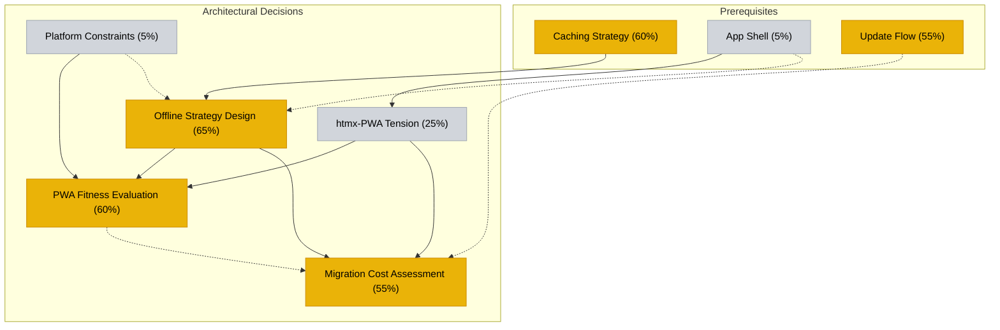
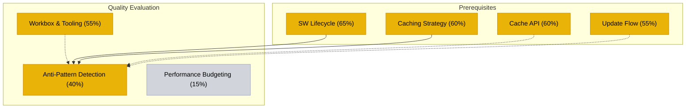
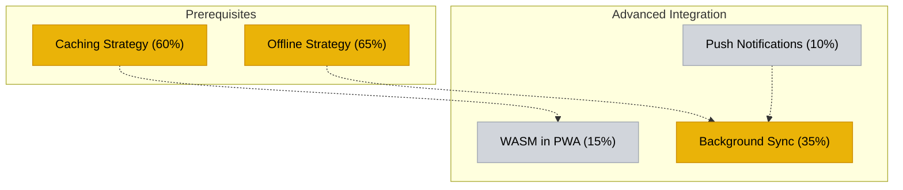

# PWA Knowledge Graph — Mastery Overlay

## Module 1: Caching Foundations

## Module 2: Caching Strategy

## Module 3: Architectural Decisions

## Module 4: Quality Evaluation

## Module 5: Advanced Integration

## Legend

- 🟢 Green = Mastered (≥80%)
- 🟡 Yellow = Developing (30-79%)
- ⬜ Gray = Not started (<30%)
- Solid arrows = Hard prerequisites
- Dashed arrows = Soft prerequisites
