# IndexedDB: The Visual Guide

*For learners who already understand Cache API and service workers — positioning IDB in the storage landscape you know.*

---

## Where IDB Sits: The Storage Map

You already know the three-layer cache model (Cache API → HTTP Cache → CDN). IDB is a **different axis entirely** — it's not a cache layer, it's a **structured database** living in the browser.

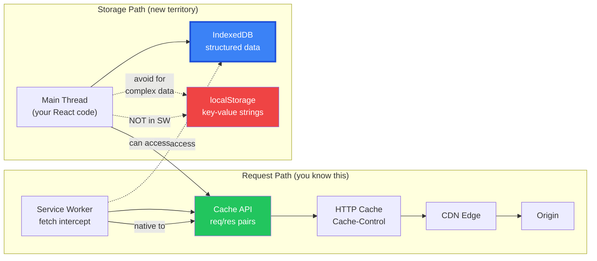

**The key insight:** Cache API stores **HTTP request/response pairs** (opaque blobs keyed by URL). IDB stores **structured JavaScript objects** you can query, filter, index, and update individually. They solve fundamentally different problems.

---

## Cache API vs IndexedDB: When to Use Which

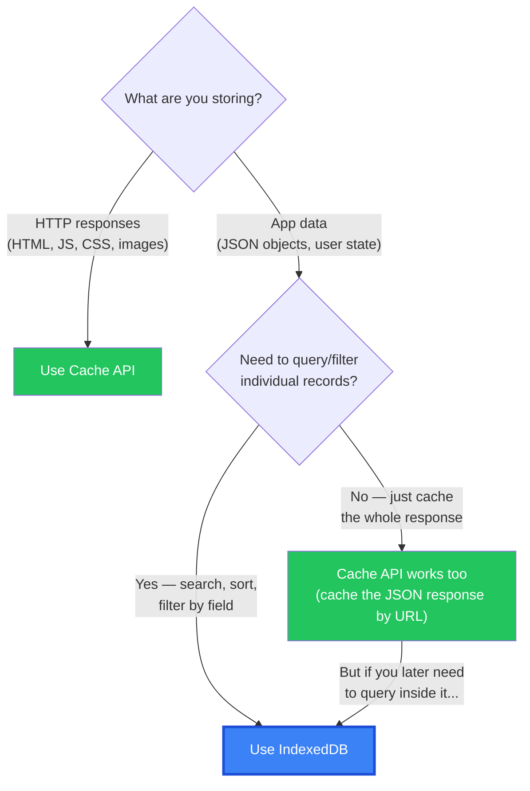

### Your StudyElf plan: why IDB, not Cache API?

Your plan caches **flashcards** and **questions**. You need to:
- Get 10 random questions filtered by `difficulty=hard` and `module=pharmacology`
- Find all flashcards where `nextReviewDate <= today`
- Update one flashcard's SM-2 state without touching the others

Cache API can't do any of that — it would give you the **entire API response blob** keyed by the URL you fetched. You'd have to deserialize everything, filter in memory, and hope you fetched with the right query params. IDB lets you store each flashcard as its own indexed record and query directly.

---

## The IDB Mental Model

Think of IDB as **a NoSQL database in the browser** — closer to MongoDB than to localStorage.

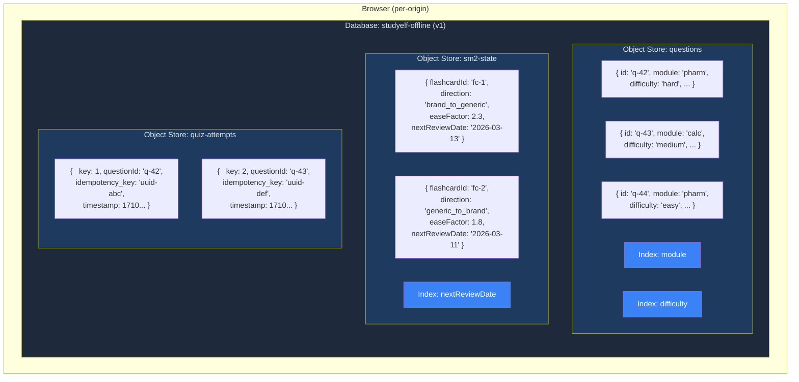

### Hierarchy (top to bottom):

| Level | Analogy | Example |
|-------|---------|---------|
| **Origin** | Database server | `https://studyelf.com` |
| **Database** | A named database | `studyelf-offline` |
| **Object Store** | A collection/table | `questions`, `flashcards`, `sm2-state` |
| **Record** | A document/row | `{ id: 'q-42', module: 'pharm', ... }` |
| **Index** | A secondary index | `module` index on questions store |

**Critical constraint:** Object stores can only be created/modified during a **version upgrade**. You can't add a store at runtime — you have to bump `DB_VERSION` and handle it in `onupgradeneeded`. This is why your plan has `DB_VERSION = 1` and creates all 8 stores upfront.

---

## The Transaction Model: IDB's Most Important Concept

This is where IDB diverges sharply from fetch/Cache API. **Every IDB operation happens inside a transaction.** No transaction, no read, no write.

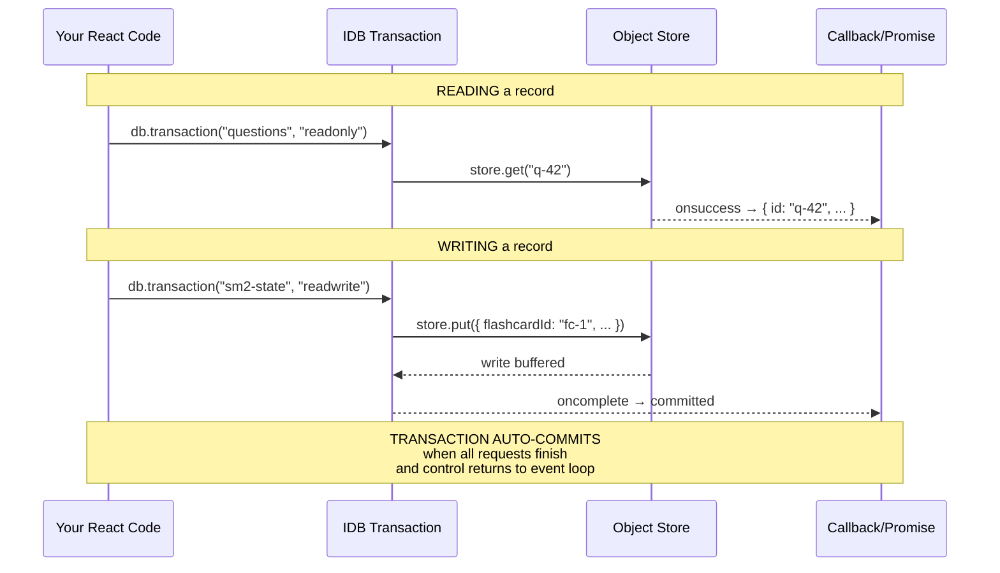

### Transaction rules (the gotchas):

1. **Transactions auto-commit** when they go idle. If you `await` something that isn't an IDB request inside a transaction (like a `fetch()`), the transaction commits/dies before your next IDB call. This is the #1 IDB footgun.

2. **"readonly" vs "readwrite"** — readonly transactions can overlap (concurrent reads). Readwrite transactions on the same store are **serialized** (queued). This matters for your sync replay.

3. **Scope** — A transaction locks specific stores. `db.transaction(["questions", "sm2-state"], "readwrite")` locks both. Keep scope minimal.

4. **No nested transactions.** One transaction, one set of operations, done.

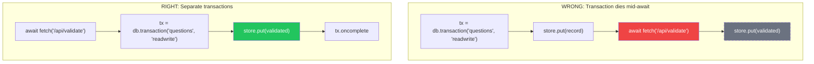

---

## Key Patterns: How Your Plan's Operations Actually Work

### Pattern 1: Write-Through (online API call → save to IDB)

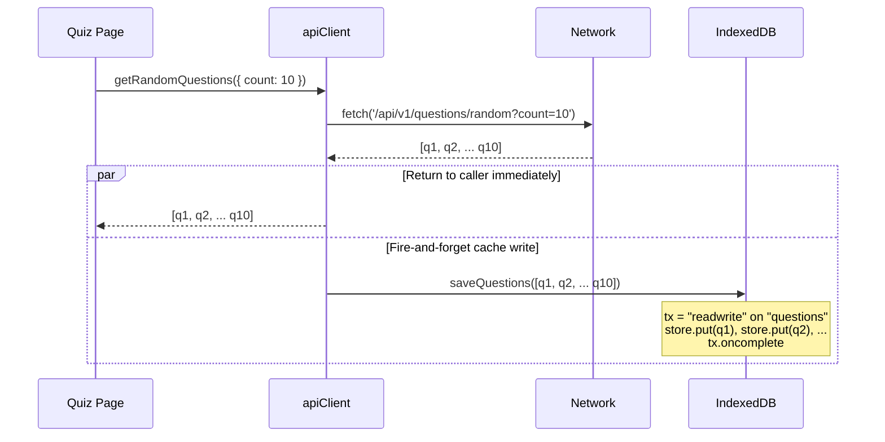

**Why `.catch()` on the write?** The write is fire-and-forget. If IDB is full (`QuotaExceededError`) or unavailable (private browsing), the user still gets their questions from the network. The cache write is an optimization, not a requirement.

### Pattern 2: Offline Fallback (network fails → read from IDB)

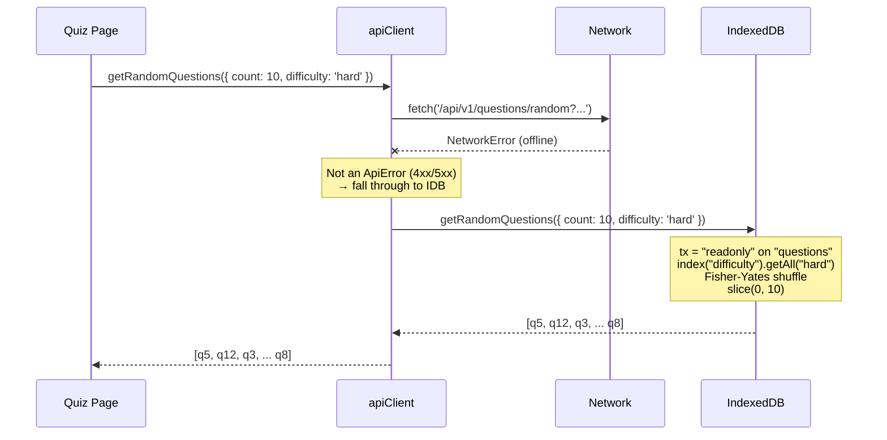

### Pattern 3: Queue + Replay (offline submit → IDB queue → sync later)

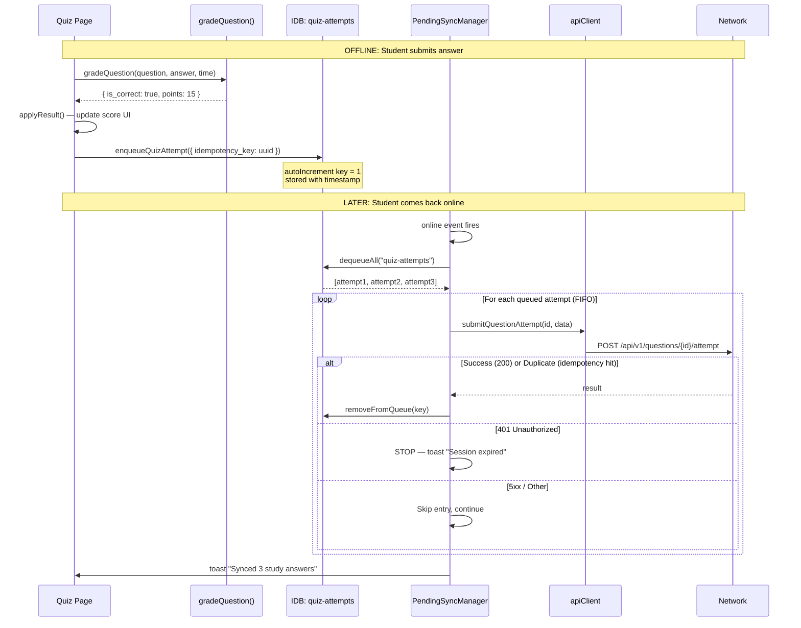

---

## Indexes: How Queries Work Without SQL

IDB has no query language. Instead, you create **indexes** on fields and walk them with **cursors** or **key ranges**.

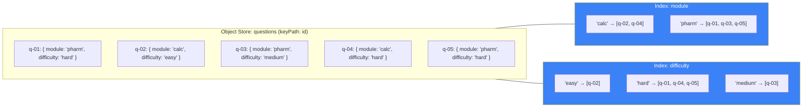

### Query: "10 random hard pharmacology questions"

```
1. store.index("difficulty")         // pick one index to walk
2. .getAll("hard")                   // → [q-01, q-04, q-05]
3. filter: r.module === "pharm"      // in-memory filter → [q-01, q-05]
4. Fisher-Yates shuffle              // randomize
5. .slice(0, 10)                     // take up to 10
```

**Limitation:** IDB can only walk ONE index at a time. Compound queries (hard AND pharm) require walking one index and filtering the rest in memory. For your ~2000-record dataset, this is fine. For millions, you'd need a compound index `[module, difficulty]`.

### Compound keyPath: SM-2 State

Your plan uses `keyPath: [flashcardId, direction]` — a **compound key**. This means each record is uniquely identified by the pair:

```
Key: ["fc-1", "brand_to_generic"]  → { easeFactor: 2.3, ... }
Key: ["fc-1", "generic_to_brand"]  → { easeFactor: 1.8, ... }
Key: ["fc-2", "brand_to_generic"]  → { easeFactor: 2.5, ... }
```

To look up: `store.get(["fc-1", "brand_to_generic"])` — returns the exact record. This is how "per-(flashcard, direction)" works. **But notice: no userId in this key** — which is Issue #1 from the review.

---

## The Version Upgrade: Schema Migration

IDB schema changes only happen inside `onupgradeneeded`. This fires when you open a database with a higher version number than what exists.

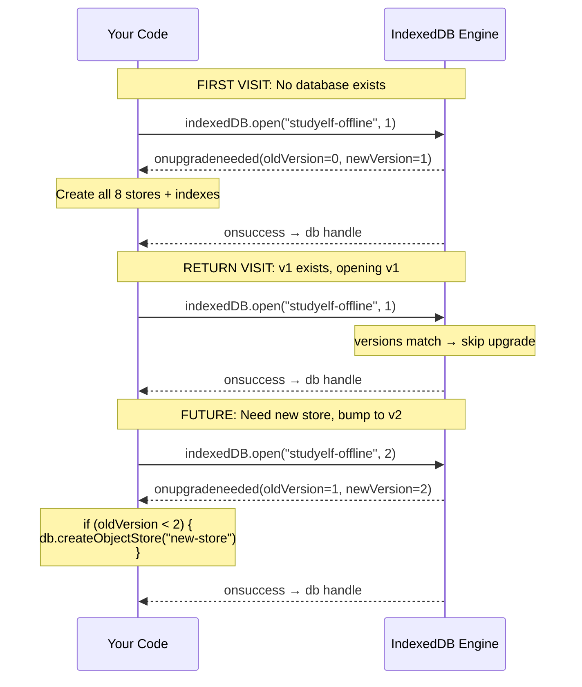

**Your plan's approach** (create all 8 stores in v1) is the right call for a first release. The version upgrade path becomes important when you ship updates — you'd write migration logic that checks `oldVersion` and incrementally adds stores/indexes.

**What happens to existing data during upgrade?** Existing stores and their data survive. Only newly created stores start empty. If you add an index to an existing store, IDB backfills it from existing records.

---

## Storage Quotas and Eviction

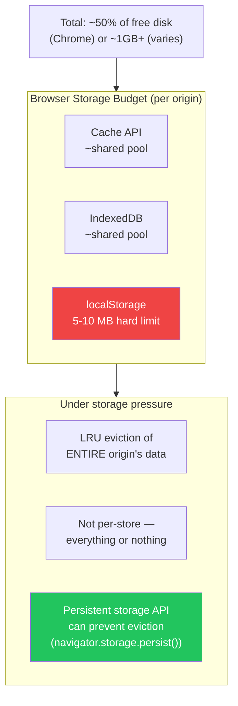

**For your plan:** ~10MB for content download is well within budget. The `QuotaExceededError` catch is defensive programming for edge cases (user's disk is nearly full, or they're on a device with aggressive storage limits).

**`navigator.storage.persist()`** — worth adding to the download flow. When granted, the browser won't evict your IDB data under storage pressure. Chrome auto-grants for installed PWAs and frequently visited sites.

---

## The User-Scoping Problem (Issue #1 Visualized)

This is the bug in your plan. Here's what happens without user scoping:

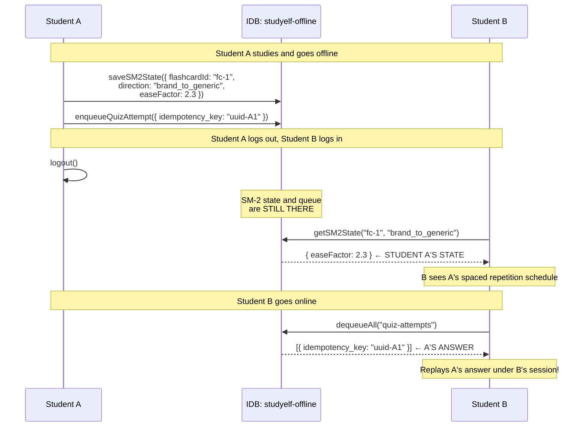

### Fix: Database-per-user

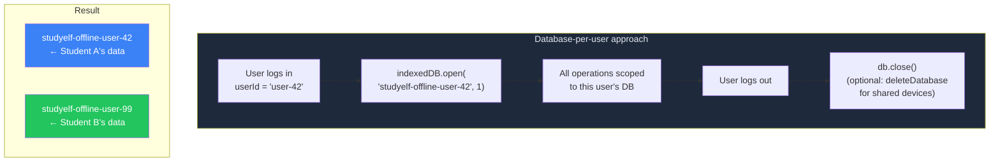

This also simplifies Edge Case #9 (logout with queued items) — you can check the user-specific DB for pending entries without worrying about cross-contamination.

---

## IDB vs Your Existing Knowledge: Transfer Map

| You already know... | IDB equivalent |
|---------------------|---------------|
| Cache API `caches.open(name)` | `indexedDB.open(name, version)` |
| Cache API `cache.put(request, response)` | `store.put(record)` (upsert by keyPath) |
| Cache API `cache.match(request)` | `store.get(key)` or `index.get(value)` |
| Cache API `caches.delete(name)` | `indexedDB.deleteDatabase(name)` |
| SW `oninstall` → precache | IDB `onupgradeneeded` → create schema |
| Serwist `ExpirationPlugin` | Manual: walk cursor, delete old records |
| HTTP `Cache-Control` headers | No equivalent — IDB has no automatic expiry |
| SQL `SELECT * WHERE x = 1` | `store.index("x").getAll(1)` |
| SQL compound `WHERE x = 1 AND y = 2` | `index("x").getAll(1)` then filter `y` in memory |
| MongoDB document `{ _id, ...fields }` | IDB record `{ keyPath, ...fields }` |

---

## Quick Reference: The IDB API Surface You'll Actually Use

```
OPEN
  indexedDB.open(name, version) → request
  request.onupgradeneeded → create stores, indexes
  request.onsuccess → db handle

SCHEMA (only in onupgradeneeded)
  db.createObjectStore(name, { keyPath, autoIncrement })
  store.createIndex(name, keyPath, { unique })

READ
  db.transaction(stores, "readonly")
  store.get(key)                    → one record
  store.getAll()                    → all records
  index.get(value)                  → first match
  index.getAll(value)               → all matches
  index.openCursor(range, direction) → iterate

WRITE
  db.transaction(stores, "readwrite")
  store.put(record)                 → upsert (by keyPath)
  store.add(record)                 → insert (throws if exists)
  store.delete(key)                 → remove one
  store.clear()                     → remove all

KEY RANGES (for cursor queries)
  IDBKeyRange.only(value)
  IDBKeyRange.lowerBound(value, open?)
  IDBKeyRange.upperBound(value, open?)
  IDBKeyRange.bound(lower, upper, lowerOpen?, upperOpen?)

LIFECYCLE
  db.close()
  indexedDB.deleteDatabase(name)
```

---

## Summary: Five Things to Internalize

1. **IDB is a structured database, Cache API is a request/response cache.** Different tools for different jobs. Your plan uses both correctly — SW/Serwist for static assets via Cache API, IDB for queryable content data.

2. **Transactions auto-commit when idle.** Never `await` a non-IDB operation inside a transaction. Do your network/computation first, then open a transaction for the IDB write.

3. **One index at a time for queries.** Compound queries = walk one index + filter in memory. Fine for thousands of records, not for millions.

4. **Schema changes only in `onupgradeneeded`.** Plan your stores upfront. Future changes require version bumps with migration logic.

5. **IDB is per-origin, not per-user.** If your app has multiple users on one device, you must scope the database (by name or by keyPath). Your plan currently doesn't — that's the bug.
