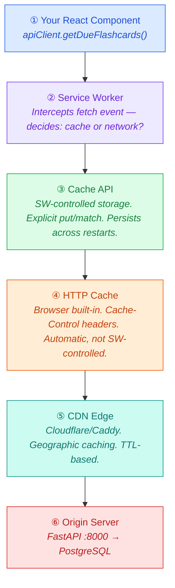
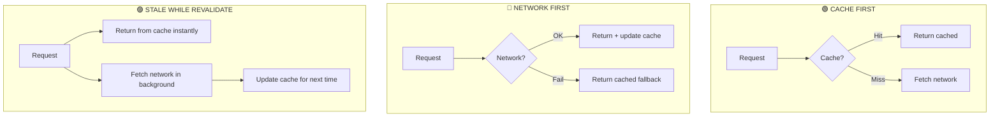

# Progressive Web Apps — Architecture Reference

> *Architecture Reference for StudyElf PWA Evaluation*

---

## 1. Overview

### What Is a PWA?

A **Progressive Web App** is a web application enhanced with platform capabilities: **installability**, **offline access**, and **background features**. It's still a website — it just gains native-app-like powers through three key technologies:

| Technology | Role |
|:---:|:---:|
| **Service Worker** | Network proxy in the browser |
| **Web Manifest** | Install metadata (JSON) |
| **HTTPS** | Mandatory secure transport |

> *PWA is a spectrum, not binary. You pick which capabilities matter for your app.*

---

### PWA is NOT...

| Misconception | Reality |
|---|---|
| A framework | It's a set of **browser APIs** |
| All-or-nothing | Adopt **incrementally** |
| A replacement for native apps | Different **tradeoffs** |
| Free offline | You architect the **caching strategy** |
| Automatically fast | You set **performance budgets** |

---

### Three Pillars

```
┌─────────────────────────────────────────────────────────────┐
│                    PWA THREE PILLARS                         │
├───────────────────┬───────────────────┬─────────────────────┤
│  SERVICE WORKER   │  WEB APP MANIFEST │     HTTPS           │
│  [REQUIRED]       │  [REQUIRED]       │     [REQUIRED]      │
├───────────────────┼───────────────────┼─────────────────────┤
│ Network proxy in  │ JSON file with    │ Mandatory for SW    │
│ browser. Inter-   │ app name, icons,  │ registration        │
│ cepts fetches,    │ display mode,     │ (except localhost). │
│ manages caches,   │ theme. Enables    │ Prevents MITM       │
│ enables offline.  │ "Add to Home      │ attacks on the      │
│ Runs in separate  │ Screen" install   │ network proxy.      │
│ thread, persists  │ prompt.           │                     │
│ after tab close.  │                   │                     │
└───────────────────┴───────────────────┴─────────────────────┘
```

---

### StudyElf PWA Fit

**Green flags:**
`✓ "use client" architecture` · `✓ REST conventions (GET/POST)` · `✓ Event-sourced reviews` · `✓ Pre-deployment`

| Dimension | Decision |
|---|---|
| **Offline scope** | Student study flows only |
| **Online-only** | Instructor/admin dashboards |
| **Sync model** | Event replay (FlashcardReview) |
| **SM-2 offline** | Client-side calculation |
| **Open question** | Quiz answer security |

---

## 2. Browser Request Lifecycle

Every fetch request passes through up to **6 layers**. The service worker intercepts **BEFORE** the network.



> **Key insight:** The SW intercepts at layer 2. For **GET** requests (reads), it can return cached data without ever hitting layers 3–6. For **POST** requests (writes), it queues them in IndexedDB and replays when online. Your React code doesn't know the difference.

---

## 3. Service Worker Lifecycle

The SW has a strict lifecycle. Understanding it prevents the #1 PWA bug: *"why aren't my changes showing up?"*

```mermaid
flowchart LR
    R["📥 Register<br/>Browser downloads sw.js"]:::gray
    I["📦 Install<br/>Pre-cache critical assets"]:::blue
    W["⏳ Wait<br/>Old SW still controls tabs"]:::yellow
    A["⚡ Activate<br/>New SW takes control"]:::green
    F["🌐 Fetch<br/>Intercepts all requests"]:::purple
    U["🔄 Update<br/>Byte-diff check on navigate"]:::orange

    R --> I --> W --> A --> F --> U

    classDef gray fill:#f3f4f6,stroke:#6b7280,color:#374151
    classDef blue fill:#dbeafe,stroke:#2563eb,color:#1d4ed8
    classDef yellow fill:#fef9c3,stroke:#ca8a04,color:#a16207
    classDef green fill:#dcfce7,stroke:#16a34a,color:#15803d
    classDef purple fill:#ede9fe,stroke:#7c3aed,color:#6d28d9
    classDef orange fill:#ffedd5,stroke:#ea580c,color:#c2410c
```



### The Waiting Trap

When you deploy a new `sw.js`, the browser downloads it but the **old SW keeps running** until ALL tabs are closed. The new SW sits in **"waiting"** state.

> **Why?** If you have a flashcard session open in one tab and the new SW activates mid-session, it might serve new cached assets that are incompatible with the old page code. Safety first.

> **`skipWaiting()`** forces immediate activation. Useful in dev, risky in production. Better: show a "New version available — refresh?" banner.

### SW Scope Rules

A service worker controls URLs **at or below** its registration path.

| SW Location | Controls |
|---|---|
| `/sw.js` | Everything: `/`, `/modules/*`, `/api/*` |
| `/modules/sw.js` | Only `/modules/*` paths |
| `/app/sw.js` | Only `/app/*` paths |

> **StudyElf:** Register at root (`/sw.js`) to intercept API calls to `/api/v1/*`.

---

## 4. Five Caching Strategies



| Strategy | Flow | Use When | StudyElf Use | Risk |
|---|---|---|---|---|
| **Cache First** | Cache → Network (fallback) | Static assets, app shell, fonts | JS/CSS bundles, icons | Stale until SW update |
| **Network First** | Network → Cache (fallback) | Frequently changing, auth-dependent | Dashboard analytics, leaderboard | Slow when offline-transitioning |
| **Stale While Revalidate** | Cache (instant) + Network (background) | Moderate freshness, speed matters | Drug content packs, cheat sheets | Shows stale data once before refresh |
| **Network Only** | Network (no cache) | Real-time data, auth tokens, POST | Login, review submissions | Fails offline completely |
| **Cache Only** | Cache (no network) | Pre-cached immutable assets | Downloaded offline packs | Never updates without SW push |

---

## 5. Storage: Cache API vs IndexedDB

```
┌──────────────────────────────┐  ┌──────────────────────────────┐
│        🔵 CACHE API          │  │       🟣 IndexedDB           │
├──────────────────────────────┤  ├──────────────────────────────┤
│ • Request/Response pairs     │  │ • Structured objects         │
│ • SW-controlled (put/match)  │  │ • Queryable, indexed, txn   │
│ • Perfect for API responses  │  │ • Perfect for offline queues │
│ • Versioned by cache name    │  │ • Large capacity (100s MB)   │
│                              │  │                              │
│ StudyElf: Flashcard API      │  │ StudyElf: Queued review      │
│ responses                    │  │ events, SM-2 state           │
└──────────────────────────────┘  └──────────────────────────────┘
```

> **Neither of these is the browser HTTP cache.** The HTTP cache is automatic and controlled by `Cache-Control` headers from your server. Cache API and IndexedDB are explicit and controlled by your service worker code.

---

## 6. Offline Architecture: Cache Reads, Queue Writes

```mermaid
flowchart TD
    subgraph reads["🟢 GET Requests — Reads"]
        R1["Student taps<br/>'Start Flashcards'"]:::blue
        R2["SW intercepts<br/>GET /api/v1/flashcards"]:::purple
        R3["Returns from<br/>Cache API"]:::green
        R4["React renders<br/>cards normally"]:::teal
        R1 --> R2 --> R3 --> R4
    end

    subgraph writes["🟠 POST Requests — Writes"]
        W1["Student rates<br/>card quality: 4"]:::blue
        W2["SW intercepts<br/>POST /review"]:::purple
        W3["Queued in<br/>IndexedDB"]:::orange
        W4["Background Sync<br/>replays on reconnect"]:::yellow
        W1 --> W2 --> W3 --> W4
    end

    classDef blue fill:#dbeafe,stroke:#2563eb,color:#1d4ed8
    classDef purple fill:#ede9fe,stroke:#7c3aed,color:#6d28d9
    classDef green fill:#dcfce7,stroke:#16a34a,color:#15803d
    classDef teal fill:#ccfbf1,stroke:#0d9488,color:#0f766e
    classDef orange fill:#ffedd5,stroke:#ea580c,color:#c2410c
    classDef yellow fill:#fef9c3,stroke:#ca8a04,color:#a16207
```



---

## 7. Event Sourcing Sync Model

StudyElf's `FlashcardReview` table is already an **event log**. Each review is a discrete event (card, quality, timestamp). Sync sends events, not state.

```
┌─────────────────────────────────┐  ┌─────────────────────────────────┐
│     ❌ LAST-WRITE-WINS          │  │     ✅ EVENT SOURCING           │
├─────────────────────────────────┤  ├─────────────────────────────────┤
│ Sync: "ease_factor = 2.1"      │  │ Sync: "card X rated 4 at T"    │
│                                 │  │                                 │
│ Problem: multi-device           │  │ Server replays all events       │
│ conflicts lose data             │  │ in order. No conflicts.         │
└─────────────────────────────────┘  └─────────────────────────────────┘
```

> **SM-2 offline:** The scheduling math (ease_factor adjustment, interval calculation) is simple enough to run client-side in JS. The review events sync back; the server recomputes final state from the full event stream.

---

## 8. What Stays Online-Only

| ✅ Offline-capable | ⬜ Online-only |
|---|---|
| Flashcard sessions | Instructor dashboard |
| Quiz practice | Admin management |
| Cheat sheet viewing | Content review workflows |
| Calculations practice | Cohort analytics |
| Medical terminology | Content generation (Dagster) |

---

*PWA Architecture Reference · Generated for StudyElf V3 evaluation · Session 1–2 material*
