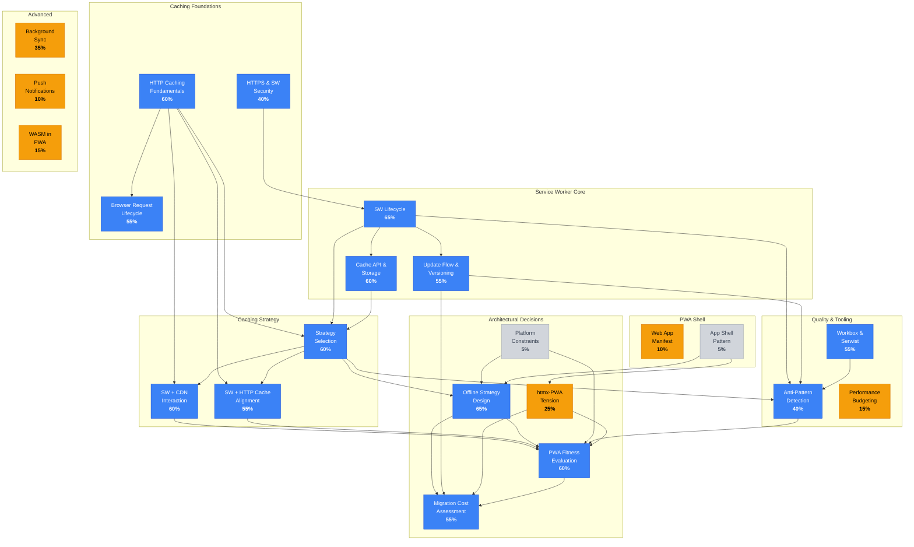
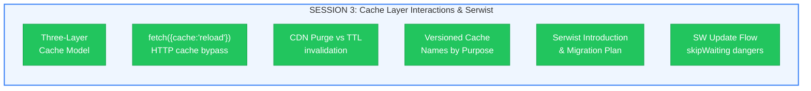
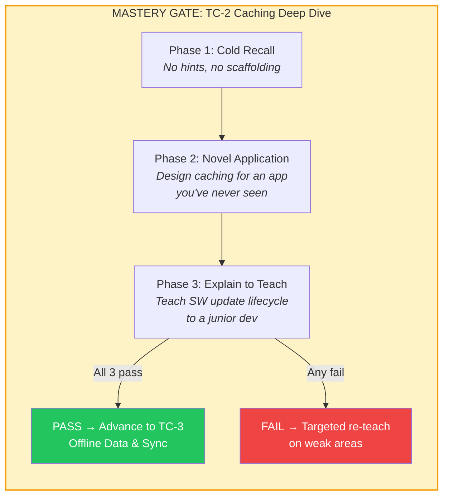
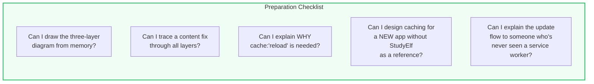
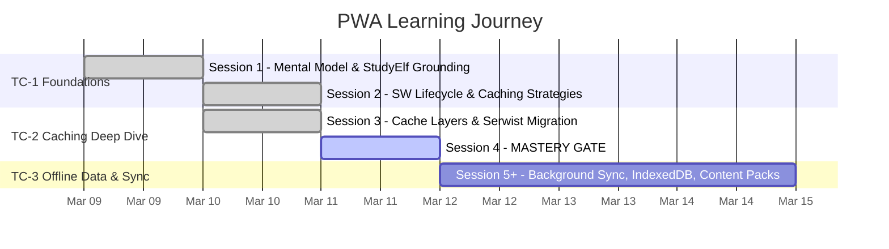

# PWA Learning: Sessions 3 → 4 Progress Map

---

## Knowledge Graph — Current Mastery



**Legend:** <span style="color:#3b82f6">**Blue = Familiar (40-70%)**</span> | <span style="color:#f59e0b">**Amber = Attempted (10-39%)**</span> | <span style="color:#9ca3af">**Gray = Not Started (<10%)**</span>

---

## Session 3 Recap: What You Learned



### Session 3 Scorecard

| Area | Performance | Notes |
|---|---|---|
| Retrieval probes (3) | 3/3 correct | Cache-first safety, SW lifecycle, CDN path |
| Three-layer trace | Guided correct | Missed HTTP cache layer initially, then integrated |
| Cache versioning | Strong | Independently identified single-cache anti-pattern |
| Serwist plan review | Strong | Caught `next-pwa` deprecation before building on it |
| Plan bug detection | 5/6 found with prompts | Missed `fetchOptions` in own plan (caught when prompted) |
| Self-assessment | 3.5/5 | Accurate calibration — matches observed performance |

---

## Session 4 Preview: TC-2 Mastery Gate



### What You'll Be Tested On

| Phase | Tests These Vertices | What "Pass" Looks Like |
|---|---|---|
| **Cold Recall** | SW+HTTP alignment, SW+CDN interaction, cache versioning | Trace the three-layer model without prompts. Name the bypass. Explain versioned cache cleanup. |
| **Novel Application** | Strategy selection, offline strategy, anti-pattern detection | Given a new app (NOT StudyElf), correctly choose strategies per resource type, identify cache layer risks, size caches. |
| **Explain to Teach** | Update flow design, SW lifecycle, Serwist tooling | Explain why `skipWaiting:true` is dangerous, walk through the update prompt flow, describe what Serwist handles vs raw SW. |

### How to Prepare



---

## Trajectory: Sessions 1–4



### Mastery Growth Across Sessions

```
Session 1  ████░░░░░░░░░░░░░░░░  ~20% — Built mental model
Session 2  ████████░░░░░░░░░░░░  ~40% — SW lifecycle + strategies
Session 3  ████████████░░░░░░░░  ~58% — Cache layers + Serwist + update flow
Session 4  ████████████████░░░░  ~70%? — Gate determines if ready for TC-3
```

---

## Open Questions Carried Forward

| Question | Status | When |
|---|---|---|
| Content pack download + cache-only strategy | Deferred | TC-3 |
| Quiz answer queuing with Background Sync | Deferred | Separate plan |
| ExpirationPlugin maxEntries sizing from usage data | Open | Implementation phase |
| iOS Safari PWA limitations | Not covered | TC-3 or TC-4 |
