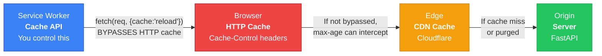
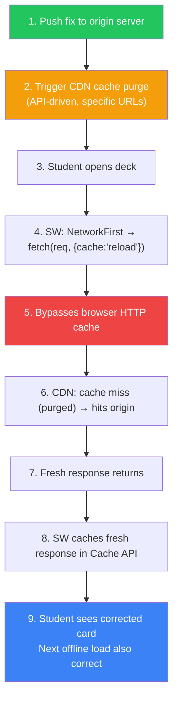
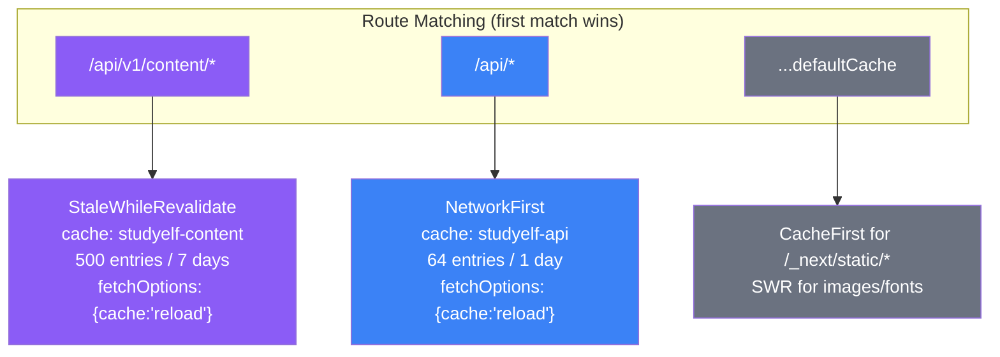
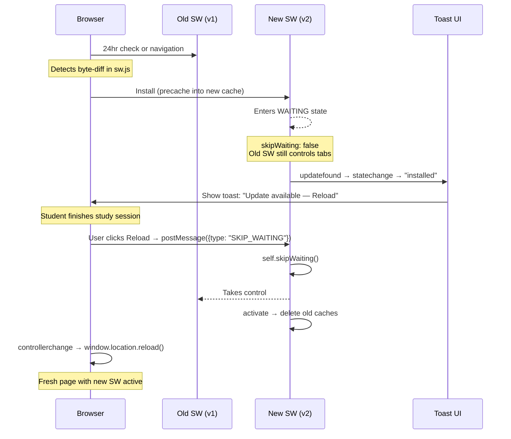

# Session 3: Cache Layer Interactions & Serwist Migration

---

## The Three-Layer Cache Model



### The Critical Bypass

```
fetch(request, { cache: "reload" })
```

Without this, `NetworkFirst` can be silently served by the browser's HTTP cache — the request never leaves the browser.

---

## Content Correction Invalidation Sequence

When you fix "Metformin is a sulfonylurea" → "Metformin is a biguanide":



---

## Cache Versioning: Multiple Named Caches

**Problem:** One versioned cache → every deploy re-downloads everything (including unchanged content packs).

**Solution:** Separate caches by lifecycle:

| Cache Name | Contents | Versioned? | Cleanup |
|---|---|---|---|
| `static-v12` | JS/CSS bundles (hashed) | Per deploy | Delete old on `activate` |
| `shell-v12` | HTML shell, offline page | Per deploy | Delete old on `activate` |
| `studyelf-api` | API responses | Never | ExpirationPlugin (entries + TTL) |
| `studyelf-content` | Drug cards, flashcards | Never | ExpirationPlugin (500 / 7 days) |

```js
// In activate handler: clean up only versioned caches
caches.keys().then(names =>
  names.filter(n => n.startsWith("static-") || n.startsWith("shell-"))
       .filter(n => n !== CURRENT_VERSION)
       .forEach(n => caches.delete(n))
)
```

---

## CDN Invalidation: Purge vs TTL

| Approach | How it works | Best for |
|---|---|---|
| **TTL** (time-based) | Content expires after N seconds | Frequently updated, low-stakes |
| **Cache Purge** (event-driven) | You call API to invalidate specific URLs | Infrequent updates, high-stakes |

**StudyElf choice:** Purge. Pharmacology errors can't wait for a timer. Long TTL + purge-on-update = fast by default, correct on demand.

---

## Serwist Configuration for StudyElf



**Key decisions:**
- `@serwist/next` (webpack) — NOT `@serwist/turbopack` (incompatible with `output: 'export'`)
- `disable: process.env.NODE_ENV === "development"` — Turbopack runs freely in dev
- Route order matters: specific `/api/v1/content/*` before generic `/api/*`
- `ExpirationPlugin` on all runtime caches — prevents unbounded growth

---

## Service Worker Update Flow



**Critical guard:** Check `navigator.serviceWorker.controller` before showing update toast. If `null`, this is first install — don't prompt.

---

## Key Concepts Quick Reference

| Concept | One-liner |
|---|---|
| `cache: "reload"` | fetch option that bypasses browser HTTP cache |
| `skipWaiting: false` | New SW waits; protects mid-session users from version mismatch |
| `clientsClaim` | Only useful with skipWaiting:true; skip for StudyElf |
| Content hash in URL | `main.a3f8c2.js` — URL immutability makes cache-first safe |
| `activate` event | Safe moment to delete old versioned caches |
| `navigator.serviceWorker.controller` | `null` on first visit; gate update prompts on this |
| `ExpirationPlugin` | Prevents runtime caches from growing forever |
| CDN cache purge | API call to Cloudflare to invalidate specific cached URLs |
| `defaultCache` | Serwist's built-in strategies for Next.js static assets |
| Route order | First match wins — put specific routes before generic ones |
