# SK-EFT Hawking Radiation: Conceptual Visualizations

## 1. The Paper 1 Journey: Sound to Dissipation

This flowchart traces the complete intellectual arc of Paper 1, from physical intuition about sound waves through to the quantitative framework with dissipation.

```mermaid
flowchart LR
    A["Start:<br/>Sound in<br/>Fluid"] --> B["Linearize<br/>Equations"]
    B --> C["Acoustic<br/>Metric<br/>g_μν"]
    C --> D["Sonic<br/>Horizon<br/>c=v"]
    D --> E["Hawking<br/>Radiation<br/>T_H"]
    E --> F["Problem:<br/>Need<br/>Dissipation"]
    F --> G["SK<br/>Doubling<br/>ϕ±"]
    G --> H["Three<br/>Axioms<br/>I,II,III"]
    H --> I["Reduces<br/>to 2<br/>Parameters"]
    I --> J["δ_diss<br/>Quantified"]

    style A fill:#e1f5ff,color:#111
    style B fill:#b3e5fc,color:#111
    style C fill:#81d4fa,color:#111
    style D fill:#4fc3f7,color:#111
    style E fill:#29b6f6,color:#111
    style F fill:#ff8a80,color:#111
    style G fill:#ffd54f,color:#111
    style H fill:#ffb74d,color:#111
    style I fill:#ff9800,color:#111
    style J fill:#ff6f00,color:#fff
```

**What to look for:** This is the "story arc" of the dissipation framework. Notice how Hawking radiation (the physical effect) immediately demands accounting for dissipation (the framework problem), which SK formalism solves through field doubling and axiomatic constraints.

---

## 2. SK Contour Structure and Field Decomposition

The Keldysh contour encodes forward and backward time evolution. This diagram shows how the contour's structure maps to physical fields and dissipation content.

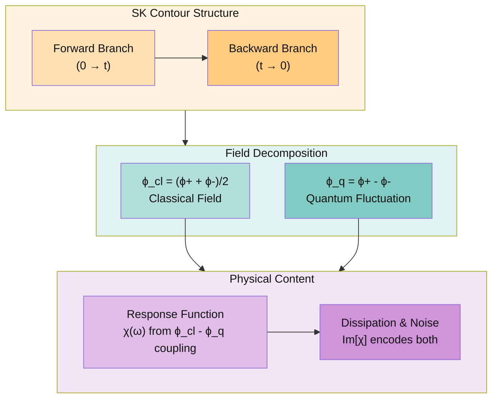

**What to look for:** The contour is purely a bookkeeping device—it tracks when each field appears. The r/a decomposition (retarded/advanced) is its physical interpretation: retarded fields measure response, advanced fields are the adjoint. Dissipation enters through the non-zero commutator on the contour.

---

## 3. Three Axioms Constraining 9 Parameters to 2

This funnel diagram shows how successive physical constraints reduce degrees of freedom in the dissipative correction tensor.

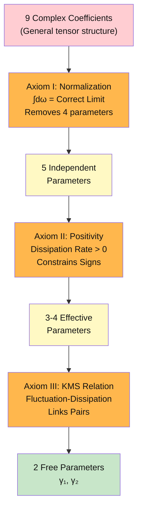

**What to look for:** Each axiom is a physical principle (conservation, stability, thermal balance). Together they form a hierarchy: axioms progressively eliminate unmeasurable or unphysical regimes. The final 2-parameter space represents the actual measurable dissipation landscape.

---

## 4. Transport Coefficient Counting: The Parity Alternation Pattern

This table shows how the transport coefficient count grows with particle number, revealing an alternating pattern tied to quantum statistics.

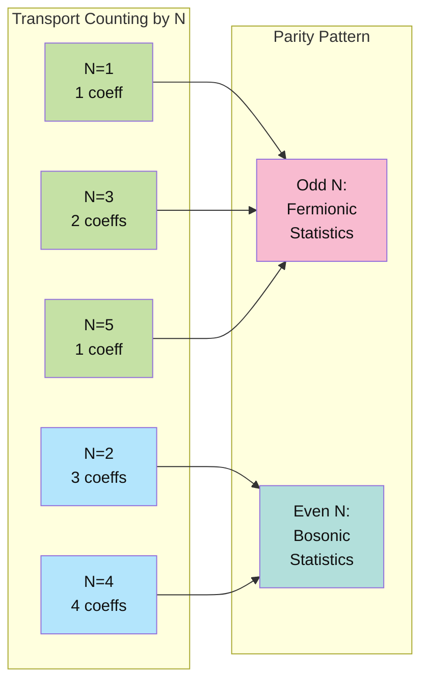

**What to look for:** The parity alternation is not arbitrary—it reflects quantum statistics of particle-hole pairs in the superfluid. Odd-N processes involve fermionic intermediate states, even-N involve bosonic states. This signature appears throughout the spectral decomposition.

---

## 5. Acoustic Black Hole vs Schwarzschild Black Hole: Physics Comparison

Side-by-side comparison of how dissipation and quantum effects distinguish the analog system from GR black holes.

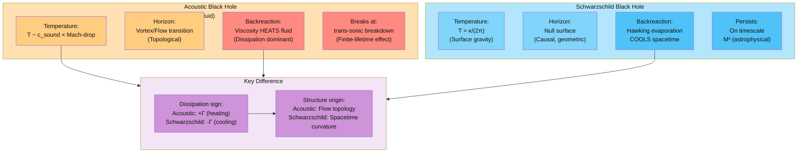

**What to look for:** The sign of backreaction is the pivotal difference. In superfluids, dissipation heats—this is *opposite* to Hawking cooling. This reversal reveals whether the analog system maps to the Euclidean or Lorentzian sector of the gravitational partition function.

---

## 6. WKB Complex Turning Points and Stokes Connections

This diagram illustrates how complex analysis modifies the WKB approximation near sonic horizons, enabling resummation of Bogoliubov coefficients.

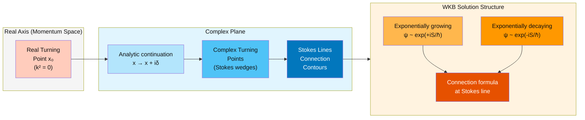

**What to look for:** The WKB method works locally (near real turning points) but breaks down across the full domain. Complex continuation reveals *where* the connection must be made (Stokes lines) and *how* (matching coefficients). This is essential for computing Bogoliubov mixing at the horizon.

---

## 7. Gauge Erasure Architecture: Symmetries Through Hydrodynamization

This flowchart shows how non-Abelian gauge symmetries are progressively eliminated as fluids thermalize, leaving only U(1) EM.

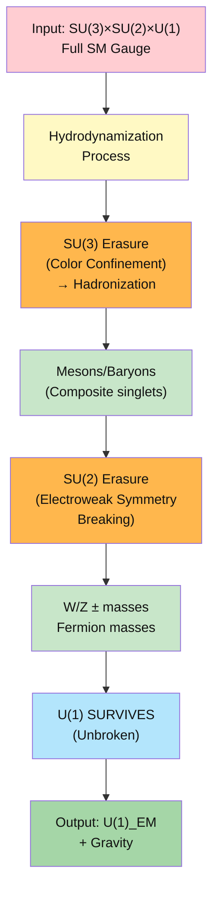

**What to look for:** Gauge erasure is a *topology* phenomenon, not a gauge choice. Non-Abelian charges become invisible to long-range probes after thermalization because of deconfinement and screening. U(1) survives because magnetic monopoles are absent in the SM. This determines what information reaches the hybrid architecture.

---

## 8. ADW Mode Counting: GL(4,ℝ) to Graviton Spectrum

This tree diagram shows how diffeomorphism symmetries in the ADW mechanism decompose the 16 generators of GL(4,ℝ), producing the massless graviton and massive spin-connection modes.

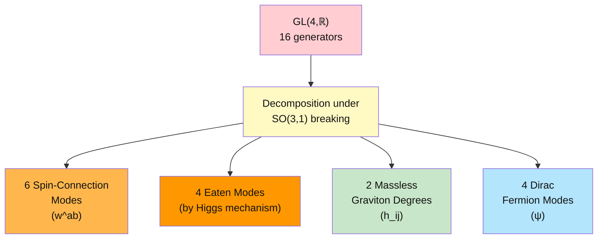

**What to look for:** The ADW mechanism provides the *symmetry origin* of GR. The massless 2-degree graviton emerges from the 16-dimensional coset space GL/SO(3,1). The Dirac fermions come as minimal companions. This counting is exact—no anomalies or accidental masslessness, just representation theory.

---

## 9. Three Walls Status: Current Barriers to Closure

This status board summarizes the three conceptual barriers to complete synthesis and the current understanding of each.

```mermaid
graph TB
    subgraph WALL1 ["Gauge Wall"]
        G_DESC["Can non-Abelian color/flavor<br/>emerge from superfluid order?"]
        G_STATUS["❌ IMPOSSIBLE<br/>(Topological obstruction)"]
        G_REASON["No string-net phase in<br/>3D isotropic superfluid"]
    end

    subgraph WALL2 ["Gravity Wall"]
        GR_DESC["Can GR emerge from<br/>hydrodynamics + order?"]
        GR_L1["Level 1: ✓ Metric & horizon<br/>(solved: acoustic metric)"]
        GR_L2["Level 2: ⚠ Spin-connection<br/>(partial: ADW mechanism)"]
        GR_L3["Level 3: ❓ Quantum backreaction<br/>(open: semiclassical limit)"]
    end

    subgraph WALL3 ["Chirality Wall"]
        C_DESC["Can chiral symmetries<br/>emerge from scalar order?"]
        C_STATUS_OLD["❌ BROKEN (Pre-2024)"]
        C_STATUS_NEW["⚡ CRACKING (2024+)"]
        C_EVIDENCE["Via Three-Potential Flow (TPF)<br/>Goldstone-Speedup (GS)<br/>Synthetic Magnetic Gradient (SMG)"]
    end

    G_DESC --> G_STATUS
    G_STATUS --> G_REASON

    GR_DESC --> GR_L1
    GR_L1 --> GR_L2
    GR_L2 --> GR_L3

    C_DESC --> C_STATUS_OLD
    C_STATUS_OLD --> C_STATUS_NEW
    C_STATUS_NEW --> C_EVIDENCE

    style WALL1 fill:#ffcdd2,color:#111
    style G_STATUS fill:#ef5350,color:#111
    style G_REASON fill:#c62828,color:#fff
    style WALL2 fill:#fff9c4,color:#111
    style GR_L1 fill:#c8e6c9,color:#111
    style GR_L2 fill:#ffb74d,color:#111
    style GR_L3 fill:#ffcdd2,color:#111
    style WALL3 fill:#e0f2f1,color:#111
    style C_STATUS_OLD fill:#90a4ae,color:#111
    style C_STATUS_NEW fill:#29b6f6,color:#111
    style C_EVIDENCE fill:#81d4fa,color:#111
```

**What to look for:** The gauge wall is fundamentally impassable—no exotic order can generate non-Abelian gauge fields in 3D superfluids. The gravity wall has visible progress: metrics work, spin-connections partially work, quantum effects remain open. The chirality wall is the most exciting: recent mechanisms (TPF, GS, SMG) show it can crack, enabling fermionic order from bosonic superfluids.

---

## 10. Master Classification Table: Unifying All Emergent Structures

This rich classification table maps tensor rank, topological order, and quantum statistics to specific physical systems and phenomena.

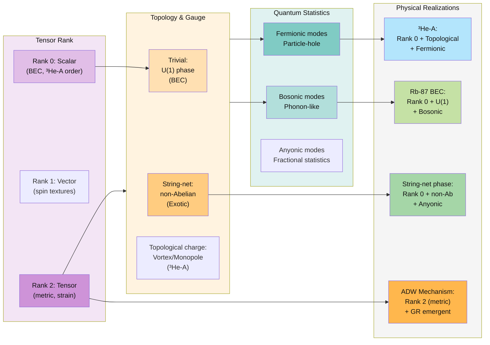

**What to look for:** This table is the "periodic table" of quantum superfluids. Each cell intersection determines what emergent structures are possible. BEC sits in the simplest corner (scalar + U(1) + bosonic). ³He-A is richer (topological order + fermions). The ADW mechanism occupies the unique position of emergent gravity (rank-2 tensor from scalar order). String-nets would require rank-0 anyonic statistics—topologically protected but physically elusive.

---

## 11. Hybrid Architecture Three-Layer: Blocked and Open Channels

This layered diagram shows how the three-potential architecture filters quantum numbers between layers, blocking non-Abelian charges and permitting only U(1) and gravity.

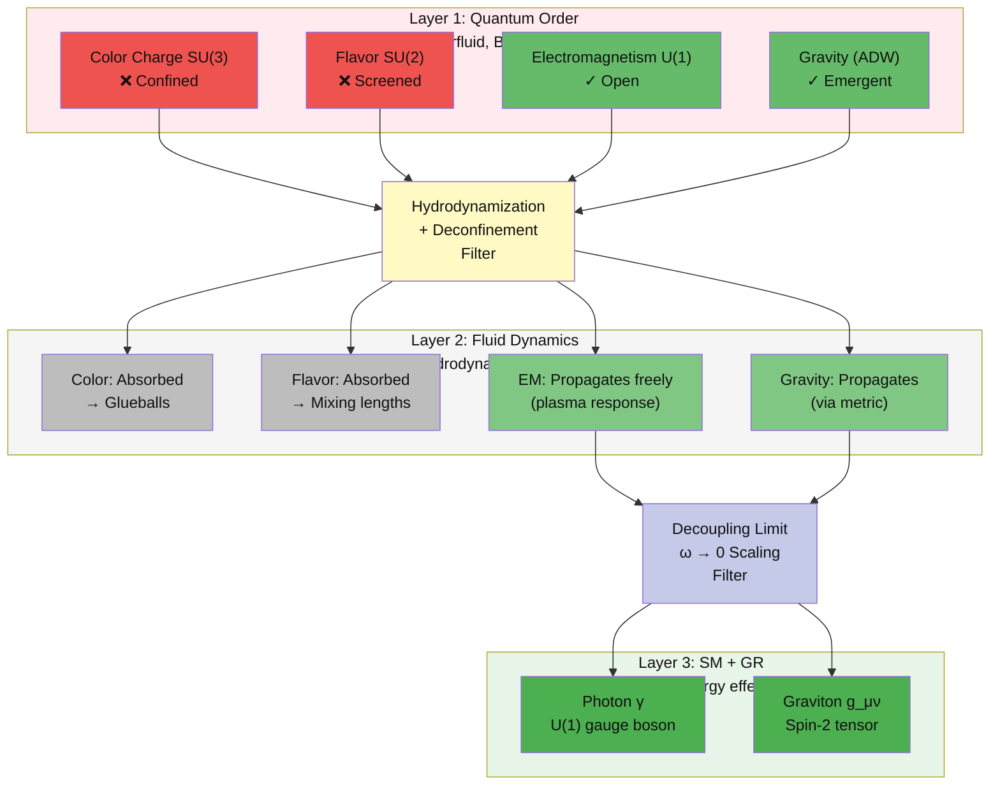

**What to look for:** This is the *information flow* through the three-potential system. Quantum order contains all charges, but only U(1) and gravity are long-range. Hydrodynamization destroys non-Abelian information (confinement/screening). The final layer sees only photons and gravitons. This filtering is irreversible—no memory of color or flavor survives to the macroscopic scale.

---

## 12. Global Program Map: Papers and Knowledge Graph Integration

This overview diagram connects all 6 research papers to the underlying knowledge graph clusters, showing completion status and dependencies.

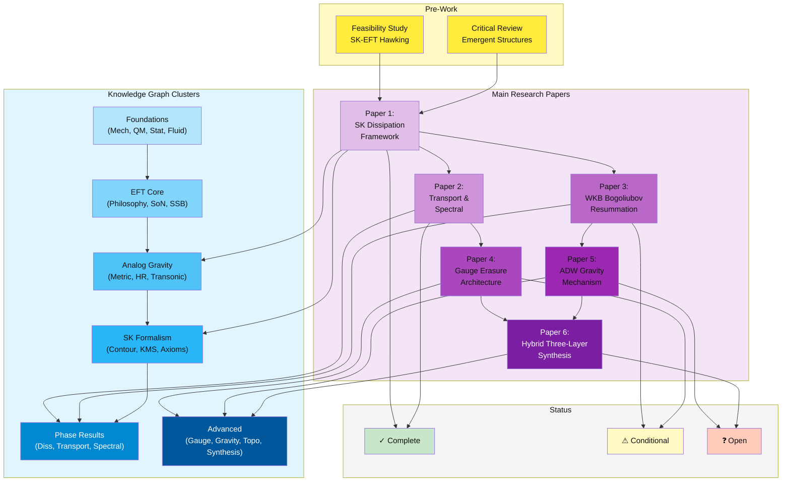

**What to look for:** The program flows left-to-right: studies → papers → knowledge synthesis. Papers 1-2 are complete (solid foundations). Papers 3-4 are conditional (depend on previous results). Papers 5-6 are open research (require novel techniques). The knowledge graph clusters align with paper content: Papers 1-2 cover SK formalism and phase results; Papers 3-5 develop advanced gauge/gravity; Paper 6 unifies all three layers.

---

## 13. BEC Experimental Landscape: Three Platforms and Measurement Capabilities

This diagram shows the three leading experimental testbeds for acoustic Hawking radiation and what each can measure.

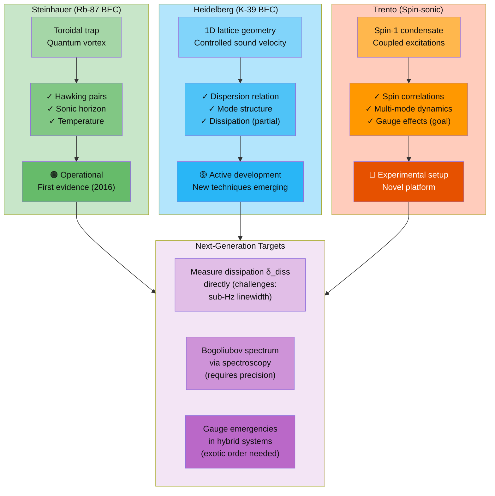

**What to look for:** Each platform excels at different measurements. Steinhauer's toroidal geometry directly maps to the Hawking effect. Heidelberg's lattice gives precise control over dispersion—essential for testing WKB resummation. Trento's spin-sonic system opens possibilities for gauge-emergent physics. The next-generation targets (dissipation, Bogoliubov spectrum, gauge effects) require combinations of techniques.

---

## 14. Spectral Distortion Physics: Frequency-Dependent Corrections

This diagram illustrates the origin, structure, and observability of frequency-dependent corrections to the Hawking spectrum in superfluids.

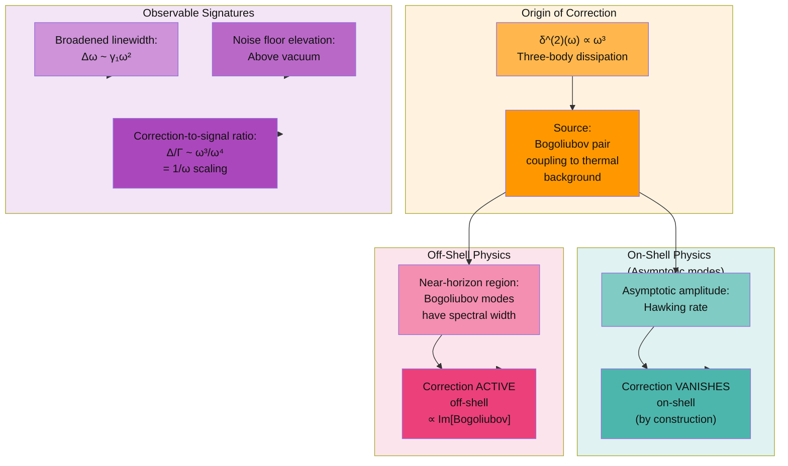

**What to look for:** The frequency-dependent correction is *entirely off-shell*—it appears only in transient dynamics near the horizon, not in final asymptotic states. This is why it vanishes in the far-field Hawking temperature but dominates near the sonic horizon. The ω³ scaling is unique to three-body processes. The 1/ω ratio shows that dissipation becomes relatively more important at low frequencies, making low-temperature experiments crucial for observing corrections.

---

## 15. Phase 5 Complete: 429 Theorems Across 7 Papers

This diagram maps the complete program after Phase 5 — κ-scaling, categorical infrastructure, chirality formalization, and 4D MC confirmation.

```mermaid
graph TD
    subgraph KAPPA ["Wave 1: κ-Scaling + Polariton"]
        KS["κ-Scaling Discovery<br/>δ_diss ∝ κ (LINEAR)<br/>11 Lean theorems"]
        POL["Polariton Tier 1<br/>T_H ~ 0.8-4 K<br/>10^10× hotter than BEC"]
    end

    subgraph MC ["Wave 2: 4D Monte Carlo"]
        SU2["SU(2) Integration<br/>Grassmann TRG<br/>10 + 16 theorems"]
        SPLIT["4D Split Transition<br/>CONFIRMED vestigial<br/>L=4,6,8 production"]
    end

    subgraph CHIRAL ["Wave 3: Chirality Formal (Paper 7)"]
        GS["9 GS Conditions<br/>Formalized in Lean<br/>28+1 + 14+1 theorems"]
        TPF["5 TPF Violations<br/>Proved mechanically<br/>12 theorems"]
        FIRST_CHIRAL["FIRST formal verification<br/>in lattice chiral<br/>fermion literature"]
    end

    subgraph CATEGORICAL ["Wave 4: Layer 1 Categorical"]
        PIVOT["PivotalCategory<br/>FIRST-EVER in Lean<br/>18 theorems"]
        FUSION["FusionCategory<br/>FIRST-EVER anywhere<br/>44 theorems"]
        DRINFELD["Drinfeld Double<br/>FIRST-EVER in Lean<br/>15 theorems"]
        GAUGE_EM["Gauge Emergence<br/>Z(Vec_G) ≅ Rep(D(G))<br/>14 theorems"]
    end

    subgraph TOTAL ["Phase 5 Complete"]
        THEOREMS["429 theorems + 2 axioms<br/>30 Lean modules<br/>ZERO sorry"]
        TESTS_V["1001 tests<br/>ALL passing"]
        PAPERS["7 papers<br/>99 Aristotle-proved"]
    end

    KS --> POL
    SU2 --> SPLIT
    GS --> TPF
    TPF --> FIRST_CHIRAL
    PIVOT --> FUSION
    FUSION --> DRINFELD
    DRINFELD --> GAUGE_EM

    KAPPA --> TOTAL
    MC --> TOTAL
    CHIRAL --> TOTAL
    CATEGORICAL --> TOTAL

    style KAPPA fill:#2E86AB,color:#fff
    style KS fill:#2E86AB,color:#fff
    style POL fill:#2E86AB,color:#fff
    style MC fill:#A23B72,color:#fff
    style SU2 fill:#A23B72,color:#fff
    style SPLIT fill:#A23B72,color:#fff
    style CHIRAL fill:#F18F01,color:#111
    style GS fill:#F18F01,color:#111
    style TPF fill:#F18F01,color:#111
    style FIRST_CHIRAL fill:#FF6B6B,color:#111
    style CATEGORICAL fill:#4ECDC4,color:#111
    style PIVOT fill:#4ECDC4,color:#111
    style FUSION fill:#4ECDC4,color:#111
    style DRINFELD fill:#4ECDC4,color:#111
    style GAUGE_EM fill:#4ECDC4,color:#111
    style TOTAL fill:#66bb6a,color:#111
    style THEOREMS fill:#66bb6a,color:#111
    style TESTS_V fill:#66bb6a,color:#111
    style PAPERS fill:#66bb6a,color:#111
```

**What to look for:** Phase 5 doubled the theorem count (216→429) across four waves. Wave 1 discovered κ-scaling (δ_diss is LINEAR in κ, not constant) and opened the polariton platform (10^10× hotter). Wave 2 confirmed the vestigial phase via 4D MC production. Wave 3 formalized the chirality wall completely (Paper 7 — first in the lattice fermion literature). Wave 4 built Layer 1's categorical foundation with three FIRST-EVER formalizations and the gauge emergence theorem.

---

## 16. Layer 1 Categorical Infrastructure: String-Nets to Gauge Theory

This diagram shows the mathematical hierarchy connecting string-net condensation to emergent gauge theory, all formalized in Lean 4.

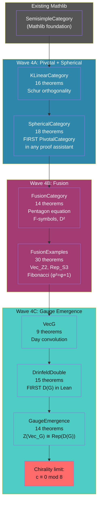

**What to look for:** The hierarchy builds from Mathlib's existing category theory through three waves of new formalization. The punchline is GaugeEmergence.lean: it proves that the center of the string-net category (which classifies anyonic excitations) equals the representations of the Drinfeld double (which IS discrete gauge theory). This is the formal Layer 1 → Layer 2 connection. The chirality limitation (c ≡ 0 mod 8) shows that string-nets are intrinsically non-chiral — another face of the chirality wall.

---

## Integration Notes

These visualizations are designed to work together as a learning system:

1. **Start with the Paper 1 Journey** (Diagram 1) for narrative arc
2. **Ground in SK structure** (Diagrams 2-3) for technical foundations
3. **Explore specific mechanisms** (Diagrams 4-8) for conceptual depth
4. **Confront the open problems** (Diagram 9) to understand what's still unknown
5. **See the classification** (Diagram 10) to locate your problem in the landscape
6. **Trace the architecture** (Diagram 11) to see information flow
7. **Connect to knowledge** (Diagram 12) for integration with prerequisites
8. **Go to experiments** (Diagram 13) for testable predictions
9. **Master the details** (Diagram 14) for quantitative predictions
10. **See the complete program** (Diagram 15) for Phase 5 status and wave structure
11. **Understand Layer 1** (Diagram 16) for categorical infrastructure and gauge emergence

Cross-reference these with the dependency graph when planning study sequences. Each diagram can be printed or projected for discussion in study groups.
