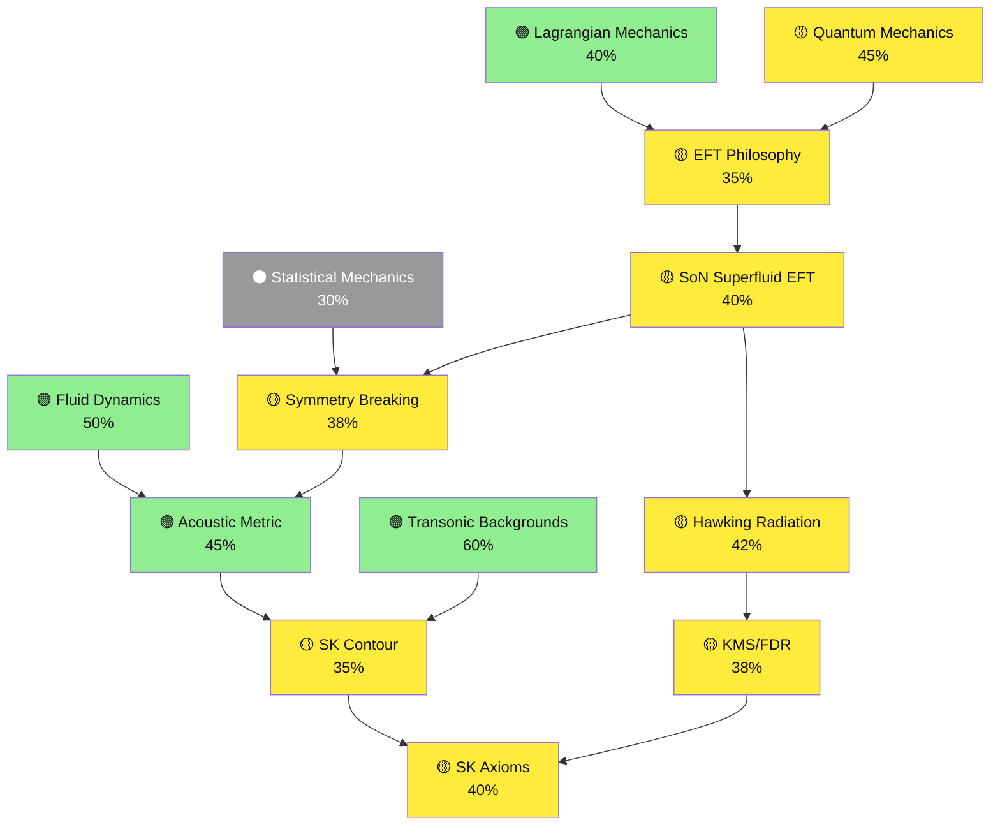
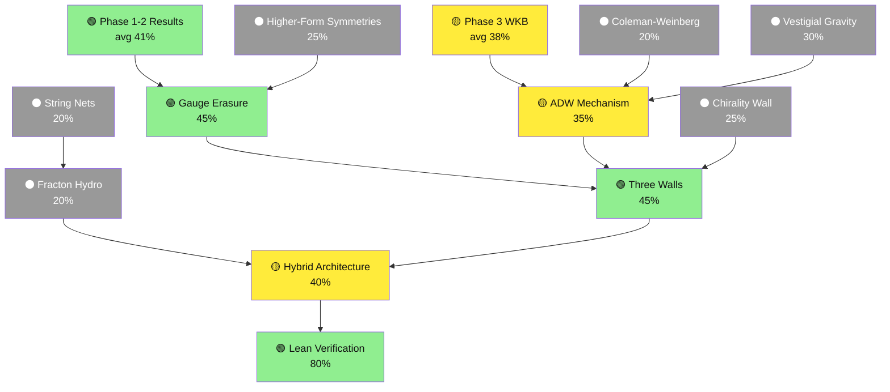
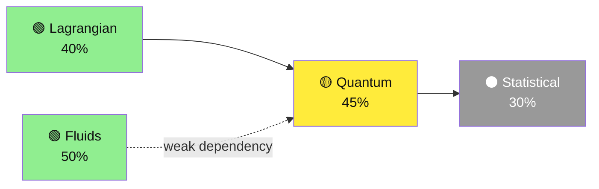
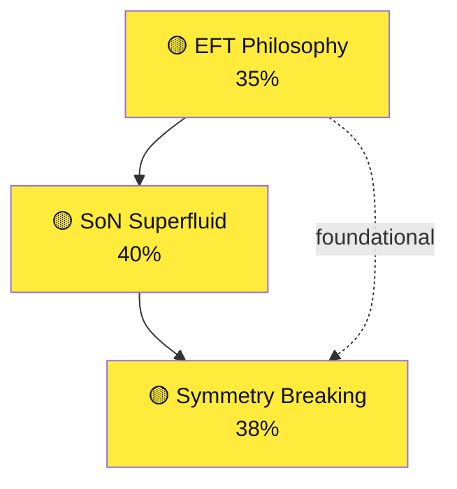
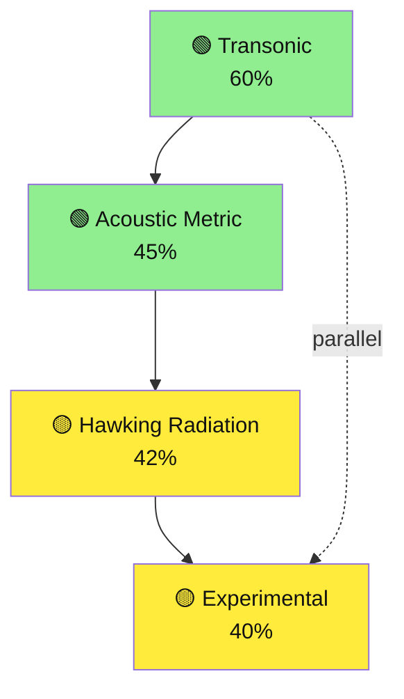
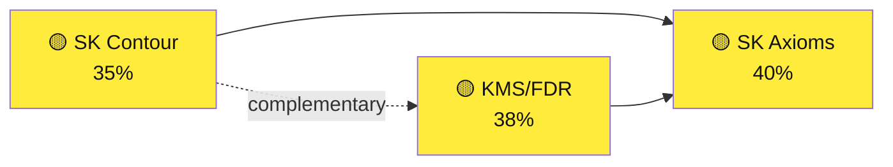
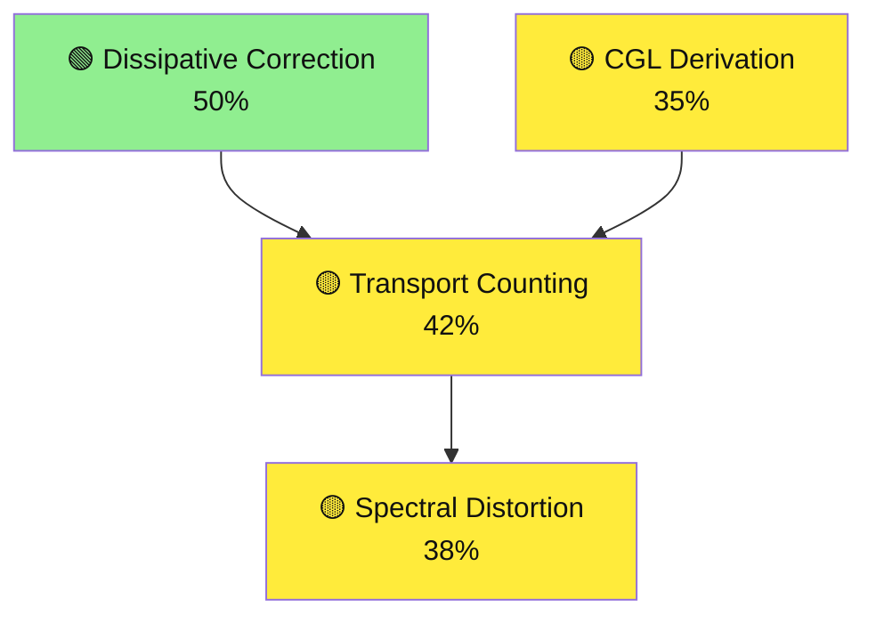
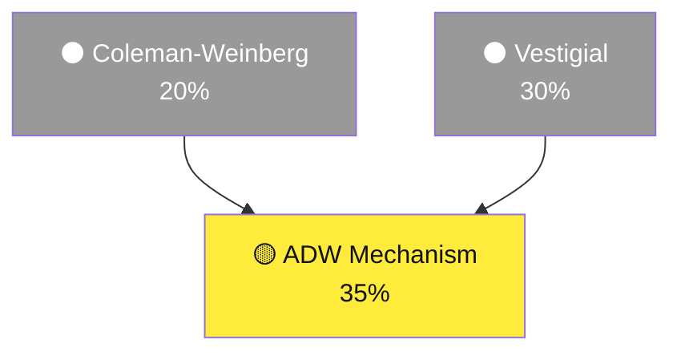
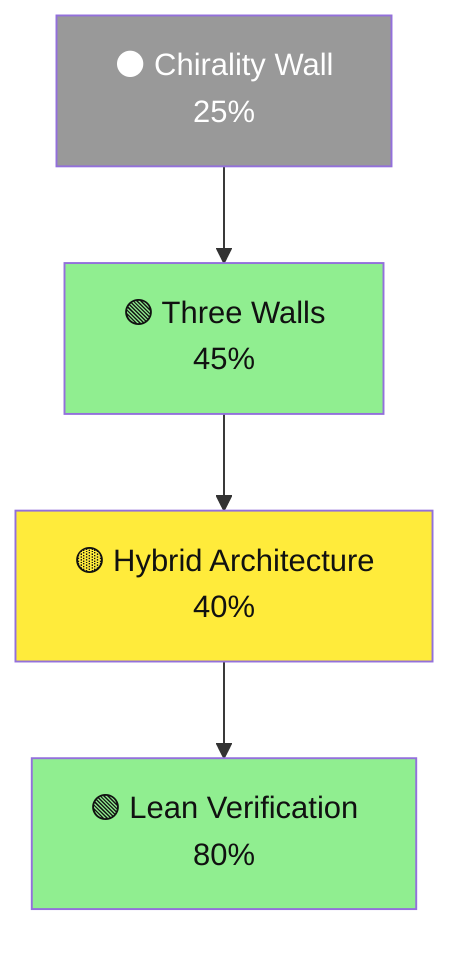
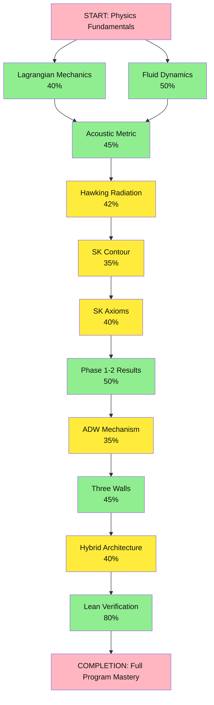

# SK-EFT Hawking Radiation: Dependency Graph Visualizations

## Overview: Part 1 - Foundations through Formalism

This diagram traces the critical path from foundational physics through EFT frameworks to SK formalism fundamentals.

## Overview: Part 2 - Gauge, Gravity, Topology, and Synthesis

This diagram shows the more advanced pathways through gauge structure, emergent gravity, topological aspects, and synthesis achievements.

---

## Cluster-Focused Views

### Cluster 1: Foundations (4 nodes)

### Cluster 2: EFT Core (3 nodes)

### Cluster 3: Analog Gravity (4 nodes)

### Cluster 4: SK Formalism (3 nodes)

### Cluster 5: Phase 1-2 Results (4 nodes)

### Cluster 6: Emergent Gravity (3 nodes)

### Cluster 7: Synthesis & Final Results (4 nodes)

---

## Critical Path: Minimal Prerequisite Chain

This diagram shows the shortest path from foundational concepts to the complete synthesis. Follow the primary arrows for essential prerequisites.

**Critical Path Analysis:**
- **Essential Sequence Length:** 13 concepts (shortest viable learning path)
- **High Priority Gaps:** Statistical Mechanics (30%), Vestigial Gravity (30%), String Nets (20%)
- **Recommended Focus:** Consolidate developing (yellow) concepts before advancing
- **Bottlenecks:** SK Axioms and Phase 1-2 Results unlock synthesis (TW/HA)

---

## Legend & Interpretation

| Color | Status | Meaning |
|-------|--------|---------|
| 🟢 Green | Mastered (40%+) | Ready to build on; review available |
| 🟡 Yellow | Developing (35-39%) | Active learning; needs practice |
| ⚫ Gray | Not Started (<30%) | Prerequisite or optional; plan ahead |
| ➖ Dashed | Locked | Requires prerequisites first |

**Nodes show:** Concept name, progress percentage
**Arrows:** Prerequisite flow (direction: dependency direction)
**Organization:** Grouped by academic cluster; prerequisites top-to-bottom
